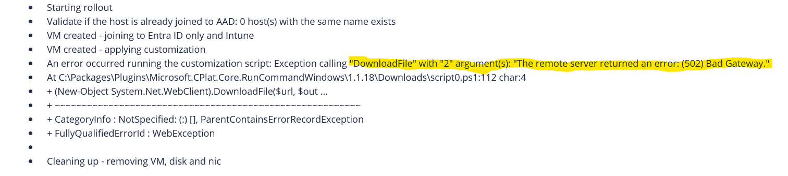
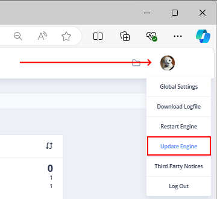
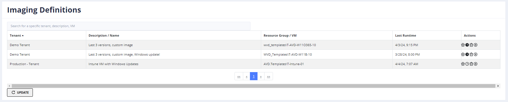

# AVD Hydra & WVD-Hydra

[Get free support for the deployment](mailto:info@itprocloud.com)

## Terms
"Hydra" is a solution to manage Azure Virtual Desktop (Azure Virtual Desktop) for one or more tenants. It's a working solution and can be installed in any subscription. The solution can be used at your own risk and without the right of indemnity. However, I am trying to publish the preview releases in high quality.

The project is available as a **free community edition, even for commercial use** (up to 5 session hosts per host pool and a single tenant) and as a supported licensable product ($5 per concurrent user/month - high-water mark of simultaneously connected user in the subscription month). Hydra will generally work without limitation for the first 30 days and switched to the community edition. Please reach out to extend the trial period or license your Hydra instance through the Azure Subscription ([Billing subscription to Hydra](https://portal.azure.com/#create/itprocloudgmbh1628775137215.hydra-pay-c1)).

The owner of this solution is [ITProCloud GmbH](https://www.itprocloud.com/), [info@itprocloud.com](mailto:info@itprocloud.com).

Please make sure to send feedback and update the solution regularly.

## Get help
If you are not familiar with the first configuration and creating a service principal in Azure, write us a mail to give you free support: [info@itprocloud.com](mailto:info@itprocloud.com)

## **IMPORTANT**: Change of AVD Agent and Bootloader Donwload URL - Error: 502 - Bad Gateway Error
We have seen from 03/25 that the Microsoft download source for the AVD Agent is throwing an error (like the Thursday before). You will see the issue during imaging or while rolling out a new session host (if the image doesn't contains the agents or if "Download newest Agent during Rollout" was selected):

**The error message is 502 – Bad Gateway Error**

If you update Hydra to the newest version **(1.1.0.7 or newer)**, Hydra will use an updated source of the AVD Agent and Bootloader and an automatic fallback to the current download URLs.
 
Please update Hydra to the newest version to use the updated download URLs and a fallback automatism. Updating Hydra has no affect to current user sessions. Make sure that nor rollout, imaging or automation is running during the update.
 
[How to update Hydra](#updates-and-releases)

If you need to white-list the new URLs for the AVD Agent and Bootloader on your firewall or proxy, please whitelist these new URLs:
- https://go.microsoft.com/fwlink/?linkid=2310011
- https://go.microsoft.com/fwlink/?linkid=2311028

## **IMPORTANT**: Action required: Update to DesktopVirtualization API v. 2024-04-08-preview
Microsoft started to inform customers to update applications unsing the DesktopVirtualization API. The Hydra version **1.1.0.3** (expected mid of December) will use only the updated APIs. **To avoid service disruptions, update Hydra to version 1.1.0.3 or newer before March 2025.** [How to update Hydra](#updates-and-releases) 
> *You're receiving this notice because you currently manage your Azure Virtual Desktop resources using Microsoft.DesktopVirtualization APIs that are being removed.* On 11 March 2025, the following DesktopVirtualization APIs will no longer be supported, and you'll need to update to either API v. 2024-04-08-preview or API v. 2024-04-03

## Random error messages from the AVD Agent and hosts are going into "Need Assistance"
Today, I got a lot of emails and team messages. Customers are seeing the following error message on session hosts in the Azure Portal and in Hydra:
> NAT shape is Undetermined when probing [turn:20.202.248.2:3478?Udp] TURN relay health check failed for server [turn:20.202.248.2:3478?Udp] - One or more errors occurred.->Timed out waiting for Receive to complete - Code: -2147467259 - 2024-09-26T07:39:15.704086Z

This causes several issues. [Read more](avd-agent-need-assistance.md)

## Possible issues with version 1.0.7.3 to 1.0.8.0: Freeze of operations (Starting, Rollout, etc.)
We got some feedback that, in very few situations, Hydra was unable to communicate with some resources in Azure. That stops the processing of some operations, like starting or creating hosts. That could also **stop autoscaling (scale-up)** from working. We guess that this issue was caused by the Microsoft package Azure.Core (1.4) and is resolved with the updated package (1.41), which is now integrated into Hydra version 1.0.8.1. Issue: [https://github.com/Azure/azure-sdk-for-net/pull/44882](https://github.com/Azure/azure-sdk-for-net/pull/44882)

If you are running into this issue, perform the following steps:
- Update to the newest version; Roboter icon in the top right corner -> Update Engine

## Features
- Multi-tenancy
- [Azure Stack HCI support](azure-stack-hci.md)
- Role-based access
- Image management
  - Create images from VMs / Golden Masters without destroying the source VM
  - Copy images to shared image galleries
  - Delete older images or gallery images
  - Deploy session hosts based on images
- Management of user sessions
  - Logoff, messages, shadow user sessions, delete [FSLogix profiles](#Delete-FSLogix-profiles-from-the-user-sessions-menu)
  - In preview: Show user processes, incl. CPU and memory usage; Terminate user processes ([requires an agent](#The-Hydra-Agent))
- Management of session hosts
  - Start, Stop, Delete, Restart, Automatically change disk types
  - Create new session hosts with a click (with classic disks or ephemeral)
  - Create new session hosts directly into the drain-mode
  - Automation scripts and script collections
- Autoscale
  - Multi-Session hosts
    - Power-on-connect support
    - Schedules
    - Autopilot: Automatically scales up/down/create/remove based on the usage of a host pool
    - Deploy hosts on demand - including ephemeral VMs based on a custom image*
    - Delete and rebuild hosts after logoff
  - VDI
    - Auto deallocate session hosts
    - Start spare-host to allow an assign on first connect for new users
    - Create new VDIs if needed based on a custom image*
- Session Timeouts
- Session host definitions for rollouts
  - Per host pool
  - Images and shared images
  - Copy configuration
- Monitoring
  - Shows the storage usage (Azure files, FSLogix profile shares)
  - Realt-time performance of session hosts, including process list via the [Hydra Agent](#The-Hydra-Agent)
- Auto Health
  - Remove orphan sessions*
- Automatic disk change
  - Disk type can automatically be changed on start/deallocation/autoscaling to save storage costs (switch between HDD-Premium-HDD or HDD-SSD-HDD)
- [Scripts and Script Collections](#Scripts-and-Script-Collections)
  - Run Powershell scripts on session hosts
  - Orchestrate hosts with multiple scripts and tasks: Drain mode on -> Logoff users -> Start the VM -> Run a script -> Restart -> Drain mode off
  - Built-in scripts/collections for Windows Update, Windows 10 optimization, ...
- ...

* Currently not available in the US

## Updates and releases
Hydra can be easily updated from the portal (full administrator permissions are needed): Click on the avatar (roboter icon) in the upper right corner and select: "Update Engine". After a while, reload the Hydra Portal website. Please only run an update if **no** deployments, scripts or imaging processes are running.

If the icon is not shown or working in your installation, update Hydra once on the deployed app service in the Azure Portal: App Service (name of your installation) -> Deployment Center -> click on "Sync"

Open to see the release history. Current version is 1.1.1.7.

Release | Date | Changes & Notes
--- | --- | ---
1.1.1.07 | 2025-05-28 | Change: Enabling auto-creation and deletion on request and for new deployments
1.1.1.06 | 2025-05-04 | Fix: In some cases, a pre-start action was not executed while the VM start was to fast
1.1.1.05 | 2025-05-01 | Fix: Due to a change of handling Patch and Post request to the AVD API (first seen on personal pools), a registration token couldn't recreated. That is fixed in this version; Add: Some more options in the sessionhost replacement wizard and for targets of schedules
1.1.1.04 | 2025-04-29 | Add: Configuration of H.265/HEVC is now possible using the Host configuration tab
1.1.1.03 | 2025-04-15 | Change: Changing the validation of Domain FQDN in the rollout configuration to allow 2 characters domains
1.1.1.02 | 2025-04-09 | Fix: A new script cannot be selected in the rollout configuration, if the rolloutconfiguration was copied from another pool in another tenant containing a local script
1.1.1.01 | 2025-04-02 | Change: The timeout for the AVD Agent was increased from 34 to 60 minutes (after 60 minutes of an upgrading host, Hydra will tag the host as Upgrading Time Out). Reason: The current AVD Agent (SxS-Stack) took sometimes longer to finish the upgrading process
1.1.1.00 | 2025-04-01 | Fix: The AVD API is reporting a non-defined value if you have a "MultiplePersistent" host pool (allowing to add a user to several hosts), the unexpected value caused an exception which is now resolved
1.1.0.09 | 2025-03-21 | Add: Detection if a downloaded MSI realy a MSI and not a HTML error page (imaging and deployment script); Adding the new download URLs for the AVD agent and bootloader
1.1.0.08 | 2025-03-20 | Remove quick-fix; Add: An alternated download address can be configured via the Hydra backend and will take action if the regular URLs are not working (optional)
1.1.0.07 | 2025-03-20 | Quick-Fix / Workaround: AVd Agent and bootloader download failed while the MS website is throwing a 502 error message. This version will use the existing binaries or download it from an alternative, temporary source
1.1.0.06 | 2025-03-17 | Add: Keep up to 20 older images; Change: Improvement of the imaging script: Disabled services are restored on the first restart 
1.1.0.05 | 2025-03-13 | Add: Imaging and rollout will prevent Bitlocker from encrypting a disk during sysprep; The task "PM - Update App" accepts the Winget Id of application comma separated to only updated specific apps (no spaces in the list)
1.1.0.04 | 2025-01-15 | Add: Support to image NVMe Golden Master (note: to rollout a NVMe only VM use a prepared Image Gallery Definition with the NVMe option)
1.1.0.03 | 2024-12-12 | Change: Update of the VirtualDesktop APIs to prevent issues because of the deprectaion of older APIs starting March 2025; Add: Show the graph in the host pools for up to 72h (configurable in the global settings)
1.1.0.02 | 2024-12-02 | Fix: Golden Master and HCI can now be in different subscriptions; Fix/workaround: The GPU driver is now automatically installed at the end of the deployment—we still recommend having the driver in the Golden Master while the drive installation causes a random reboot.
1.1.0.01 | 2024-11-22 | Add: New action session host recreate (deletes a host and creat a new one with the old name; use carefully); Fix: Imaging will handle an Azure Monitoring Agent installation on the Golden Master; Fix: Image upload to HCI is now possible if Master VM is in another Azure region
1.1.0.00 | 2024-11-22 | Add: Improvements for the optional Hydra agent 3.0 (showing RTT, CPU, Memory, etc. for the last hour in realtime); Add: Admins can now select the availability zone from a list if needed; Add: Auto-managed pools (preview) are marked with a lock and deployments are disabled; Upgrade of some modules;
1.0.8.90 | 2024-10-11 | Add: Querying hosts by REST will show the deployment state; Add: Sysprep monitoring for imaging will resolve more sysprep-errors as before (6)
1.0.8.80 | 2024-10-04 | Add: Users with FullAdmin in a single tenant can see the log of all operations in this tenant (also from other users); Add: Support for Windows 24H2; Add: FSLogix profiles can now be removed for Cloud only identities
1.0.8.70 | 2024-09-30 | Change: Hosts in "Need Assistance" mode (not failed) - VDI hosts in this state are also included in the scaling down
1.0.8.60 | 2024-09-25 | Change: Hosts in "Need Assistance" mode (not failed) will count as "available" and to the host pool capacity. Additionally, hosts in "Need Assistance" mode are deallocated by autoscale (that is different from the last versions) - Note: If a host failed (e.g. during a non accessible AppAttach package), the host will stay running but no longer counting to the capacity. That can cause the start / creation of addition hosts and results into a loop starting all hosts or creating the max. number of new hosts. Always ensure not having a death loop with failed hosts. 
1.0.8.50 | 2024-08-28 | Add: New target for script shedules: All hosts without a specific tag; Add: Optional teams notification for canceled jobs; Add: Add notes to single hosts in the extended view of the session host list; Add: Options to the schedules for autoscaling, script schedules, imaging: run on specific weeks in a month (advanced configuration of the schedules); Add: If a VM has the tag "AVD.AdvIgnoreDiskChange"="1", the disk type of the VM is not changed on start or deallocate (even autoscaling)
1.0.8.40 | 2024-08-28 | Add: Support for shallow (fast) replication of images in galleries; Add: New role 'Host pool VM, user manager and remove hosts'; Add: Action log are now stored to log analytics after completition; Add: Option (Global settings) to show the dashboard as table instead of tiles; Fix: Send messages to all users of a hosts could failed with an arithmetic error message
1.0.8.30 | 2024-07-29 | Add: Automatic detection of the gallery definitions accelerated network setting: The clone during the imaging process will inherit this setting; Add: Additional option to the Hydra [REST calls](#External-REST-Calls): Query scripts and collections and assign them to hosts; Update: Automatic versioning name for Gallery definition during the imaging improved
1.0.8.20 | 2024-07-23 | Add: Notification of orphan VMs from failed imaging processes; Change: Select all hosts or user sessions are modified: If one item is selected, a click on select all would unselect all items or (if no icon is selected) select all filtered or shown items; Fix: Paging filter was not shown for less then 50 sessions or hosts
1.0.8.10 | 2024-07-16 | Fix: We got some feedback that, in very few situations, Hydra was unable to communicate with some resources in Azure. That stops the processing of some operations, llike starting or creating hosts. We guess that this issue was caused by the Microsoft package Azure.Core (1.4) and is resolved with the updated package which is now integrated in Hydra. Issue: https://github.com/Azure/azure-sdk-for-net/pull/448821.0.8.10 | 2024-07-16 | Fix: We got some feedback that, in very few situations, Hydra was unable to communicate with some resources in Azure. That stops the processing of some operations, like starting or creating hosts. We guess that this issue was caused by the Microsoft package Azure.Core (1.4) and is resolved with the updated package, which is now integrated into Hydra. Issue: [https://github.com/Azure/azure-sdk-for-net/pull/44882](https://github.com/Azure/azure-sdk-for-net/pull/44882)
1.0.8.00 | 2024-07-16 | Add: More monitoring for the resource authentication
1.0.7.90 | 2024-07-10 | Add: More monitoring for rollout new hosts 
1.0.7.80 | 2024-07-08 | Fix: ADE disks was not shown the Key Vault information in the Azure Portal; Add: Configure a "Teams notification Workflow URL" in the Global Settings to get inforamtion about orphan resources or old service principal secrets in teams (configre a notification); Add: New script collection task: Disconnect users
1.0.7.70 | 2024-07-04 | Add: If a host deployment is interrupted by a restart of the engine (which can happen and is controlled by Microsoft), the VM can run but is not visible in AVD (orphan VM). If detected, those VMs are deallocated by default (can configured in the global settings)
1.0.7.60 | 2024-07-02 | Add: Performance improvement for larger environments (5k to 200k+ users), also scale Hydra's app service plan and database, holding users sessions NOT in the database can be configured on the app settings: "config:UseLocalUserDb" to "1"; it's expected that this will change to default in upcoming versions 
1.0.7.50 | 2024-06-28 | Fix: While replacing a lot of hosts with a task schedule, the names for the new VMs were generated in a few events doubled; Fix: Start a rollout for an HCI host failed for a new pool with version 1.0.7.4; Add: Notification of orhphan session hosts
1.0.7.40 | 2024-06-25 | Add: Notification for orphan VMs and unresponsive AVD agents (running VMs but not reporting to the AVD backend). A notification appears on the dashboard for tagged VMs (AVD.Type=SessionHost) if an issue is detected multiple times (at least for an hour). That helps to identify some resources without value but generating costs. This is only a warning, and you must be qualified in your environment. Can be disabled in the global settings.
1.0.7.30 | 2024-06-23 | Add: Support for confidential session hosts and imaging (blog post: [https://blog.itprocloud.de/AVD-How-to-image-a-Golden-Master-VM-based-on-a-plan-to-a-compute-gallery-definition/](https://blog.itprocloud.de/AVD-How-to-image-a-Golden-Master-VM-based-on-a-plan-to-a-compute-gallery-definition/))
1.0.7.20 | 2024-06-16 | Add: Capturing images based on a trusted launch Golden Master to HCI; Change: NewestImageByVM will ignore failed images or images still uploading
1.0.7.10 | 2024-05-28 | Add: Autoretry to upload images to HCI; Fix: Disconected time was not shown in version 1.0.7.0
1.0.7.00 | 2024-05-28 | Add: Adjust the chart of the host pool capacity to store and show up to 24h or 36h; Add: Performance improvements; Fix: A cloned VM during the imaging process is now keeping the encrypted on host property; Change: Upgrade to net. 8
1.0.6.10 | 2024-05-13 | Fix: Issue in imaging script with Bitlocker disks in a few environments
1.0.6.09 | 2024-05-10 | Change: Imaging of server OS improved; Change: After a session host was imaged, the host is started and deallocated; Fix: Selection of users or hosts was reaplied after triggering an action; Fix: AMA extension now gets the deployment tags
1.0.6.08 | 2024-05-07 | Add: Option to resize (increase only) the OS disk of a VM by a script collection task or from the session host overview in a pool (icon in the burger menu)
1.0.6.07 | 2024-05-02 | Fix: Hosts based on Marketplace plans shows error while chanigng properties or installing extensions (caution: using plans can result in additional costs for the plan)
1.0.6.06 | 2024-04-24 | Add: Additional option to the Hydra [REST calls](#External-REST-Calls): Session host information are now containing the VM size and OSDisk size
1.0.6.05 | 2024-04-17 | Add: Additional option to the Hydra [REST calls](#External-REST-Calls) (change VM size and size of OS-disk) 
1.0.6.04 | 2024-04-04 | Add: [Imaging defintions](#Imaging-definitions) are now available; Fix: Azure Monitoring Agent was not ever applied in the previous version
1.0.6.03 | 2024-03-26 | Add: New schedule type for scripts and collections (AllWithoutSessionsNotInDrainmode); Add: Users without modify permissions of the host pool configuration can not view the configuration; Add: Support for Azure Monitoring Agent (AMA) - select an existing DCR to target the workspace
1.0.6.02 | 2024-02-29 | Add: Create and rollout images based on a Marketplace plans (caution: using plans can result in additional costs for the plan)
1.0.6.01 | 2024-02-27 | Fix: Update of the built-in in scripts and collections
1.0.6.00 | 2024-02-24 | Add: [Support for Azure Stack HCI 23H2](azure-stack-hci.md)
1.0.5.80 | 2024-02-16 | Add: Additional option to the Hydra [REST calls](#External-REST-Calls) (filtering of subscriptions, pool types, pool groups)
1.0.5.70 | 2024-02-04 | Add: The session host list of a personal pool shows if a user has configured a personal start time (icon close to the user name) Fix: The host pool image update could be interrupted if a host was manually removed during the update Change: Update of the API versions while accessing the AVD backend
1.0.5.60 | 2024-02-04 | Fix: The value "0" in the configuration "Dynamically rollout new session hosts up to a max. number..." in Autoscale configuration was not handled correct (0 disabled the limitation)
1.0.5.50 | 2024-01-28 | Change: Improvement of some description in the Web UI
1.0.5.40 | 2024-01-23 | Add: Preview feature: Allowing special [REST calls](#External-REST-Calls) updated
1.0.5.30 | 2024-01-22 | Fix: Full-Administrators wouldn't see the scripts if the global configuration the following option was not set "Read access for Host Pool Administrators of a tenant to the content of all tenants' scripts" Add: During the imaging process, a local file is executed shortly bevore running sysprep to do some last minute generalizations (C:\Windows\Temp\PreImageCustomizing.ps1 or bat or cmd or exe)
1.0.5.20 | 2024-01-10 | Change: Script and collections - By default, only Full-Administrators can add and edit scripts and script collections. The Host Pool Administrators of full tenants can add and modify scripts by enabling "Allow Host Pool Administrators of a tenant access to scripts and collections" in the Global Settings. These scripts are only available to their tenant. With the updated concept, scripts and collections can be assigned to single or all tenants. All tenants' scripts and collections can only be assigned and modified by Full-Administrators. Change: Non Full-Administrators will no longer see some menu items where they don't have access (like roll base access, tenant configuration, etc.) Fix: Getting the newes version of an image gallery definition sometimes failed, if the version name includes 4-digit numbers (like: 2024.0001.1234)
1.0.5.10 | 2023-12-21 | Add: Defender Onboarding scripts are triggered in front of a domain join if the onboarding script is placed in C:\Windows\Temp of the Golden Master (first Onboard-NonPersistentMachine.ps1 and if not exist WindowsDefenderATPOnboardingScript.cmd) Add: Support for ADE 2 Change: Some configuration are moved into the detail section (like hibernation enabled for autoscaling - it's still in the session time outs for personal pools)
1.0.5.00 | 2023-12-12 | Fix: Using the "Hosts" settings: Idle timeout was not configured correctly (seconds instead of minutes)
1.0.4.90 | 2023-11-26 | Change: Improvement of rolling out hosts with hibernation (Hydra will warn, if a VM-size doesn't fit)
1.0.4.80 | 2023-11-23 | Change: Update of the imaging script to workaround a specific random issue: Session host cannot be joined to Entra ID and Intune if the master was enrolled in AVD and Intune before Change: Using more Entra ID instead of AAD
1.0.4.60 | 2023-11-15 | Add: Support for hibernation (if available in the subscription)
1.0.4.50 | 2023-11-13 | Add: Update of the deployment script to work-around if an image is not deployable in case of unapplied deployments
1.0.4.40 | 2023-11-08 | Change: Important: Users in role "Host pool resource manager" can now create images (before: "Full Admin" role was needed) Add: New type of host pool configuration called "Hosts". Can be used to configure the hosts on a pool base with some basic settings: FSLogix profiles, OS settings, RDS settings, Teams optimization "on" Add: New tasks in script collections: "VM - Apply OS Settings" (see before); "Host - Drain mode revert" (brings the drain-mode into the state of starting a script collection) Add: Optional await a hybrid domain-join during the rollout Add: Marketplace images for Windows 11 23H1
1.0.4.30 | 2023-10-19 | Add: Update of the rollout script to retry the installation of the AVD agent and bootloader
1.0.4.20 | 2023-10-03 | Fix: In a view cases the global settings couldn't show up in the portal
1.0.4.10 | 2023-09-28 | Add: Preview feature: Allowing special [REST calls](#External-REST-Calls) to start a rollout of hosts from external Add: Update of the imaging script to remove another dependency of an older intune deployment
1.0.3.09 | 2023-09-23 | Fix: Resolved a typo in the imaging and rollout script (in some cases, the imaging process failed with an error about LogWrite not found (instead of LogWriter))
1.0.3.08 | 2023-09-19 | Add: New option for generating images: Tag as 'TestImage' - Tags an image optionally as a 'TestImage'. Test images are ignored if the rollout configuration is set to use the newest image from a gallery definition or from a VM. Regardless, these images can be selected directly in the rollout configuration (e.g., in a test host pool). To untag, remove the tag 'AVD.TestImage' from an image or gallery version in the Azure Portal. Add: Dashboard shows the number of hosts and the number of running hosts (also in drain-mode) Add: The logs from the menu can now be downloaded (default retention time: 60 days) Add: New option in the global settings: "Add timestamps to script, imaging, and rollout logs" Add: New option in the global settings: "Try to adjust quota" - Hydra can try to increase the core quotas for non spot VMs automtically (handle with care) Change: The tag "AVD.Source" contains the resolved image resource id (e.g., the image version of a gallery definition, even if "newest" was selected) Removed: Strong generalization from the imaging menu: Is applied automatically if sysprep fails Fix: In some cases, a scheduled script was executed more then one time (again after 5 minutes)
1.0.3.07 | 2023-09-04 | Add: Extending the imaging script to handle AADLoginForWindowsWithIntune issues (the installation doesn't continue after the deployment of the extension if an older extension version was installed on the master) Add: Extending the rollout script to bring an AAD-only VM faster online (shortens the error message that the host is not domain-joined) Add: Scripts and collection schedules for personal pools: The select script or collection will run on all hosts where the assigned user is a direct member of a given group. The group object ID is expected; only direct memberships Add: New task for script collections: VmStartIfNoSchedule - Starts a VM if no personal start configuration of an assigned host exists Add: My Sessions and Hosts: Users can configure the start time of the personal hosts. Add: New option for pooled host pools: Autoscaling & Shutdown -> Advanced Settings -> Details -> Don't create temporary hosts - Create persistent hosts
1.0.3.06 | 2023-08-20 | Add: Search fields for the script and and script collection selector
1.0.3.05 | 2023-08-18 | Add: A filter for host pools in the dashboard Add: Search fields for some list boxes (like VM size) Add: Stretch mode can also be used to enumerate AVD resources (AAD) Fix: Generating new names for a host failed, if failed hosts are in Azure
1.0.3.04 | 2023-08-06 | Add: During the imaging process, all resources (VM, snapshot, nic, disk) get tags and inherit tags from the original VM Add: You can now start a host from Hydra if the resource id of the VM was changed during the imaging process Add: If the master VM of a host is a session host, the master will be started after the imaging process completes (configure autoscaling to deallocate the hosts after a while if no longer used)
1.0.3.03 | 2023-08-04 | Add: Delay of the scale down for one host (pooled host pool) after the last user logged off: Autoscaling -> Advanced options -> Scale down -> Delay shutdown of the last host in minutes Fix: Fix the issue of an interim in the imaging and deployment script: In some cases, imaging/rollout failed for some hosts. Problems exist for deployments and updates on 8/3 and 8/4, 2023. 
1.0.3.02 | 2023-07-30 | Add: Checkbox on the rollout configuration to join a host to intune for hybrid-joined hosts (before: only for AAD-only) Add: New advanced option for schedules in the autoscaling configuration: Active only (the schedule is only enabled if at least one session is in the pool) Add: New option in the global settings: "Show host pool friendly names" Add: Improvement to monitor the AVD agent on startup and handle some issues (SXS stack error)
1.0.3.01 | 2023-07-09 | Fix: Update of the installation script to install WinGet/Microsoft Package Manager applications
1.0.3.00 | 2023-07-07 | Add: New task types in script colletions: "Pool - Increase host count" and "Pool - Decrease host count" - creates or deletes standard hosts in a pool to the given target count (set it in parameter). Use carefully Add: Gallery images for Windows 11 Enterprise 22H2
1.0.2.09 | 2023-06-30 | Fix: If a API request to get a list of host pools failed during the rollout, a successful rollout was not detected (the deployment timed out and the hosts were deleted)
1.0.2.08 | 2023-06-27 | Add: Support for creating images from a secure-boot-enabled VM directly into an Azure compute gallery Add: New deployed hosts: In the first minutes, the correct start of the BootloaderAgent is monitored (if the service is not running, the service will be started) Add: Option in the global settings to hide the footer of the Hydra portal (for white-labeling)
1.0.2.07 | 2023-06-1) |Add: Preview feature "Endpoints" available and can be enabled global settings => Enable Endpoint Management Add: Modification to keep settings through Intune in the template
1.0.2.06 | 2023-05-18 | Add: The following extensions can be selected for a roll out: Antimaleware extension, Dependency extension, Guest (new)
1.0.2.04 | 2023-05-08 | Add: For new session host rollouts, a "Proximity placement group" can be configured in the advanced settings of the rollout configuration
1.0.2.02 | 2023-05-03 | Fix: In a few cases, an invalid value reported by the Hydra agent about the host's load caused the list of hosts in a pool to failed
1.0.2.01 | 2023-04-27 | Fix: Is some cases an Azure AD specific german OU prevents the engine from enumerating other subscriptions
1.0.2.00 | 2023-04-26 | Add: Option to update Hydra directly from the avatar menu (right upper corner in the roboter menu) Change: Reduce data transfered to the front-end (remove redundant health messages)
1.0.1.99 | 2023-04-19 | Add: Option for pooled hosts autoscaling (advanced options -> scale down): Ignore maintenance mode for deallocation Fix: Adding a load-balancer backend pool failed after version 1.0.1.98
1.0.1.98 | 2023-04-17 | Add: Option to assign the NSG / ASGs after the rollout completed (ASGs and NSGs are regularly applied during the rollout of new session hosts)
1.0.1.97 | 2023-04-07 | Add: All host pool configurations (like schedules, base settings, ...) can be copied from an existing configured host pool (use the list box in the upper right corner)
1.0.1.96 | 2023-04-05 | Fix: Rolloutconfiguration didn't show images with a " in the note/comment (looping donut)
1.0.1.95 | 2023-04-05 | Fix: The log of a script running on a a host, didn't disappear after 60 seconds
1.0.1.94 | 2023-03-25 | Add: Update the imaging script to be even more resilient to sysprep issues. Sysprep is now monitored, and some workarounds for sysprep are triggered automatically in case of a sysprep error
1.0.1.93 | 2023-03-24 | Add: Windows Package Manager / Winget integration (see Script Collections: PM - ...) to install applications and to update all applications on a session host and on Golden Masters Add: Running scripts and collections on a golden master now supports all VM-focused operations like running on session hosts
1.0.1.92 | 2023-02-21 | Fix: In very seldom constellations in multi-tenancy, the resource credentials couldn't be read (was null), and a retry getting the credentials happened unnecessarily (only in 1.0.1.91).
1.0.1.91 | 2023-02-19 | Add: Send a message to all users on selected session hosts (in the session host list) Add: Two new tasks in scripts and collections: SetTag, RemoveTag to set or remove a tag on the virtual machine objects Add: New option in the global settings: Debug: If a start of a host failed by a timeout (AVD agent not responding), flag the host as critically failed - the host is also excluded from autoscaling Add: New autoscaling option for pooled hosts: Advanced -> Scale Down -> Allow scale down, even if hosts are starting or in creation (prevents that scale down stocks if a host is starting and never get online) Fix: On the start of the engine, all start/stop/create/delete states are reset 
1.0.1.90 | 2023-02-08 | Fix: Some typos
1.0.1.89 | 2023-01-31 | Change: Dependency Agent is no longer automatically installed with the Azure Monitoring Agent
1.0.1.88 | 2023-01-30 | Add: New option in the global settings: Debug: Write session host data to log analytics (contains sensitive data) Fix: If the service account password contains some special characters (like "), the FSLogix delete operation failed Add: Show an alert if a file share has too less space Change: If a larger disk size is used as the image: the last partition will be automatically extend (improvement)
1.0.1.87 | 2023-01-19 | Add: Gallery images for Windows 10 22H2 Add: Imaging will now remove an existing intune client from the Golden Master Add: If a larger disk size is used as the image: the last partition will be automatically extend
1.0.1.86 | 2023-01-17 | Add: Better handling for [AAD only joined VM](#AAD-Only---Join-and-re-join-hosts) Add: In the rollout configuration: Azure Active Directory: Try to delete old device - If the service principal is in the group "Cloud Device Administrator" the sp can remove the device from AAD before deploying a new host Add: In base settings: A script or collection can be triggered before a host and VM is deleted. It can be used to unjoin AAD with the collection ''BuiltIn: Remove device from Azure Active Directory before deleting host" or for other tasks
1.0.1.85 | 2023-01-10 | Fix: If a host is deleted, existing sessions are logged off first (prevent from having an orphan host if the host is deleted manually) Add: Option to show a notification on the portal in case of an event (triggered by the vendor)
1.0.1.85 | 2022-12-19 | Add: An optional workaround to ignore if the session host goes one time into the drain mode caused by the upgrading AVD agent. The workaround can be enabled in the global settings: Ignore singe drain-mode event
1.0.1.84 | 2022-12-15 | Add: Showing the number of selected users in the user list Add: Showing the number of selected hosts in the session host list Add: Having a "back button" in the host pool configuration Add: Adding a checkbox "Use Spot instance, if possible" to the rollout configuration; comparable to the VM rollout in the Azure Portal; not recommended for [production](#Spot-instances) 
1.0.1.83 | 2022-12-09 | Add: The replacement wizard will show if a Microsoft native scaling plan is active (recommendation: disable the native scaling plan during rollout) Add: After deploying an NVDIA base VM, the rollout will wait a while to give the NVIDIA driver time to reboot the VM (unexpected behavior) Add: New configuration for autoscaling (multi-session), called [Reserve a number of existing hosts](#Reserve-a-number-of-existing-hosts)* for power-on-connect. Add: Some GUI optimizations
1.0.1.82 | 2022-11-22 | Add: A new task for a script collection: Host - Reinstall AVD Agent (experimental) - remove the host from the pool and reinstall the agent to re-join the pool. It is intended for maintenance.
1.0.1.81 | 2022-11-22 | Add: A new variable in scripts: $global:Hydra_SessionHost_AssignedUser #UPN of the assigned user of a VDI (otherwise empty string) Add: Additionally, search for an assigned user in the session host list Fix: During deployment of a new VDI, autoscaling was waiting to finish the deployment
1.0.1.80 | 2022-11-17 | Add: Configure a logo as a replacement for the header "Hydra" in Global Settings -> Others -> Use a custom logo as header
1.0.1.79 | 2022-11-11 | Fix: Deployment of Hydra agent from a script collection sometimes failed
1.0.1.78 | 2022-11-09 | Change: Longer timeout (60 minutes) to wait for the AVD Agent update
1.0.1.77 | 2022-11-08 | Change: Longer timeout to wait for the AVD Agent update
1.0.1.76 | 2022-11-06 | Add: Workaround to image Windows 11 22H2 (there is a bug in the sysprep process) Change: Timeout handling after creating a new VM. I a new host is created, the update of the AVD agent will not go into the "Upgrading Timeout" state. Background: There were cases when the AVD Agent update took 30 minutes to complete.
1.0.1.75 | 2022-10-26 | Add: "Windows 11 EVD - Gen2 - 22h2" corrected; Add: New images for 22h2 + Office Add: Caching for custom image ids based on the VM resource id (optimization for replacing session hosts)
1.0.1.74 | 2022-10-15 | Add: Certificate caching Add: Improvement of the imaging script Fix: Icon for a host in shutdown state was not shown in the session host list
1.0.1.73 | 2022-09-25 | Add: Support for certificate based authentication (use a path to a certificate as the secret (https://myKeyVault.vault.azure.net/certificates/Hydra-Service-Cert)); the app service (MSI) of Hydra needs "Get" permission for certificates on the used key vault Add: Download engine logfile (full admin permission only) Add: Restart the full engine (full admin permission only) Fix: Wait up to 3 minutes in the clean-up of a failed VM before trying to delete the NIC (a new and strange Azure behavior)
1.0.1.72 | 2022-09-07 | Add: Secure boot enabled hosts are now supporting 'Guest Attestation' (automatically installed)
1.0.1.71 | 2022-09-07 | Add: Session host table: Added value 20 to the paging list Add: New role "Users", users are seeing only their sessions and assigned hosts
1.0.1.70 | 2022-09-04 | Add: ADE can generate a new key and secret per host (left the ADE Encryption Key Url empty) Add: It's now configurable to mark a session host as "ready" after a rollout, even if the host is upgrading the AVD agent Add: Imaging script: Set the following reg key on the master to HKLM:\SOFTWARE\ITProCloud\WVD.Force to use DISM during the imaging process (takes longer) Fix: An image based on an AAD-joined golden master can now be rollout as a session host Fix: Rolloutconfiguration install Azure monitor only with workspace id and shared key
1.0.1.69 | 2022-08-28 | Add: Adding a feature from WVDAdmin: Rolling out a new host can now be done with [Azure Disk Encryption](#ADE) (ADE) Add: Accessing the database with managed service identity (optional) Add: The following extensions can be selected for a roll out: Antimaleware extension, Dependency extension
1.0.1.68 | 2022-08-19 | Add: Logs are now showing an overview (running, waiting, failed) Add: Running a task on more than 50 selected hosts is now processed as a batch. That prevents the web GUI from slowing down.
1.0.1.67 | 2022-08-17 | Add: Schedules for autoscaling and script schedules can now have a start and/or end date (click on "Show advanced time and date settings"). An empty value disables the start/end date.
1.0.1.66 | 2022-08-01 | Add: New role "Reader" Add: Reminder to remember FullAdmins to check that the secrets of the service principals are not expiring 
1.0.1.65 | 2022-07-21 | Add: Optionally, the naming schema for new hosts can be configured to only count up (and don't fill up unused numbers) Fix: In some few cases, the value for Capacity soon was higher at the end of a rollout of new hosts (during the time while the host was available and the deployment was not finished)
1.0.1.64 | 2022-07-20 | Add: Image links to Windows 10 with Microsoft 365 (Gallery) Add: Rollout configuration: Encryption at host, and custom encryption set to use customer-managed keys Add: Concept of one managed snapshot per host: A script collection can create or update a snapshot - or restore a snapshot (keep in mind to maybe deactivate the password rotation for the computer objects to avoid untrusted relationship to the domain) Add: Rollout configuration: Optionally, a managed snapshot can be used instead of replacing a host after logoff of all users from a host  Fix: The logs showed an older date in the finished column, even if the task was not finished (1/1/01)  Change: If a host runs into a timeout during the deployment, the host/VM will be deleted (before: deallocated)
1.0.1.63 | 2022-07-06 | Add: In the session host list, you can now enable/disable the extend mode to show more data about the hosts int the table (like image resource id)
1.0.1.62 | 2022-06-30 | Fix: Limit the number of connections from the Hydra agents to one
1.0.1.61 | 2022-06-29 | Add: Session host and user list: Select items on the current page Add: Rollout new session hosts in groups (max. n hosts at the same time)
1.0.1.60 | 2022-06-28 | Fix: Minor fixes in the GUI
1.0.1.59 | 2022-06-24 | Add: Filter for the session host list: !drainon, !drainoff, filter by agent version Add: Rolloutconfiguration -> Advanced settings -> Download the newest AVD agent during the rollout (instead of using the agent in the image (custom images))
1.0.1.58 | 2022-06-24 | Fix: Deleting a host during the replacement wizard run cause in re-re-replacing the host (tried multiple times)
1.0.1.57 | 2022-06-24 | Fix: Search operator !failed showed unavailable hosts as well
1.0.1.56 | 2022-06-23 | Add: Wizard to replace up to all hosts in a pool with new hosts based on a new image/configuration Add: Change the VM size directly in the session hosts view Add: A task for script collections to wait for a specific time (Others - Wait) Add: Replace  host after logoff is also available in the advanced settings of the deployment configuration Add: Navigation: Click on the session host load shows the connections Add: Optimization to query data via the resource graph (it's now faster)
1.0.1.55 | 2022-06-17 | Add: Session host and user list are now using paging to view larger lists Fix: Running a script on a session host in another subscription, then other hosts could fail ( ... does not have authorization to perform action ...) 
1.0.1.54 | 2022-06-15 | Add: A script collection can now be used to replace an existing session host. A new host is rolled out, and the old host is deleted afterward. All further tasks of the collection are applied to the new host (technically, it combines the 'add a host' and 'delete a host') in one step. The new host has another name than the existing host. Add: A notification is shown if a service principal is outdated over time.
1.0.1.53 | 2022-06-07 | Fix: Group membership of users were limited to the first 100 groups
1.0.1.52 | 2022-05-24 | Fix: In some cases, a rollout failed if the log file could not be written
1.0.1.51 | 2022-05-21 | Fix: In some cases, the rollout configuration didn't show images and some other resources (if no rollout configuration for the host pool exists)
1.0.1.50 | 2022-05-20 | Fix: Additional rollouts could start while rolling out new hosts from a schedule and directly applying a script collection with a restart command (please do not use Start or Stop VM in a collection running directy after a rollout)
1.0.1.49 | 2022-05-18 | Fix: Additional rollouts could start while rolling out new hosts from a schedule and directly applying scripts. Add: You can create hosts with secure boot from a custom image from an Azure Compute Gallery (shared image gallery). First, create an image definition with Secure Boot enabled and let Hydra capture an image from a golden master and copy it to the image definition in the gallery.
1.0.1.48 | 2022-05-09 | Change: Timeout for a host to become available increased to 24 minutes Fix: A drained host with disconnected sessions counted negitvly to the session load of the pool
1.0.1.46 | 2022-04-11 | Add: The session host list shows the performance (CPU, memory, CPU and disk queue length) of all hosts having the [Hydra Agent](#The-Hydra-Agent) running Add: Show the processes of a session host by users; terminate single processes using the [Hydra Agent](#The-Hydra-Agent) (needs role Host pool VM and user manager or higher) Add: New checkbox in 'New session host rollout': Install [Hydra Agent](#The-Hydra-Agent) to install the agent while rolling out a new session host Add: In the user view: processes can be sorted by name, resources usage, etc.
1.0.1.45 | 2022-03-22 | Fix: The copy function to copy a rollout configuration from another host pool was not working Add: Personal host pools shows the number of hosts and assigned hosts in the detail view
1.0.1.44 | 2022-03-22 | Fix: if a session host rollout failed due to sufficient capacity in Azure (even for the alternative size), did not delete the failed host Add: Extended the monitoring of VDI (personal) host pools to store the typical logon time. This will be used in an upcoming release to opt. allow a predicted disk type switching and the start of a host
1.0.1.43 | 2022-03-08 | Change: Timeout after rolling out a new session hosts (AD-joined) increase to 16 minutes; Fix: Logs are now listed in the local timezone; Fix: FlipFlopProfileDirectoryName for FSLogix corrected
1.0.1.42 | 2022-02-24 | Fix: In split tenant mode, the web gui showed the wrong networks (from the primary tenant)
1.0.1.41 | 2022-02-16 | Add: User assignment to a VDI session host can be done directly using the the session host view (add, change or delete assignment)
1.0.1.40 | 2022-02-15 | Change: User and session host list can be downloaded as CSV (showing the content of the displayed table)
1.0.1.39 | 2022-02-14 | Add: More Microsoft marketplace images; Optional and currently experimental*: Notify users to log off and on again to consolidate sessions in multi-session environments (consolidation is then done with the depth-first load balancer) 
1.0.1.38 | 2022-02-08 | Add: Date of the creation of a session host is stored in the database; Change: The load in the host pool view (last 12h) are now stored high efficiently to increase the performance if you have a lot of host pools (50+) - *Note:* The update will reset the 12h charts
1.0.1.37 | 2022-02-01 | Add: Align to the Azure Portal: Don't show error messages with error code != 0 and HealthCheckResult!='HealthCheckSucceeded'
1.0.1.36 | 2022-01-28 | Add: Optionally delete session hosts after a specific time of no use (personal host pools) - use carefully
1.0.1.35 | 2022-01-21 | Add: The last time a connection was seen is now stored on a session host level in the database. This will be used for version 1.0.1.36 to optionally delete session hosts after a specific time of no use
1.0.1.34 | 2022-01-20 | Fix: Deployment of new VDI doesn't started under some conditions
1.0.1.33 | 2022-01-18 | Add: Increase of the time out for an AAD-only deployment (takes much longer to join an AAD instead of an AD)
1.0.1.32 | 2022-01-13 | Add: Improvement to display host-pool tiles on the dashboard (visualization needed an reload to view new host pools); improvement to recognize ephemeral hosts
1.0.1.31 | 2022-01-07 | Fix: In some cases the script engine has not started after a hosts shows an error from the AVD backend
1.0.1.30 | 2022-01-04 | Fix: The process list of a user was sometimes not shown (error message about the JSON data) correctly if the user had a long process list
1.0.1.29 | 2021-12-16 | Fix: Image reference "Windows 10 EVD - Gen2 - 21h2" corrected; Add: New images for 21h2 + Office
1.0.1.28 | 2021-12-15 | Fix: Preview feature "Show process list" doesn't show processes for disconnected users
1.0.1.27 | 2021-12-07 | Preview Feature: Show user processes ([requires an agent](#The-Hydra-Agent)) Add: A fix to handle that sometimes the Azure API returns an empty resource id to the VM for a session host
1.0.1.25 | 2021-11-12 | Add: Improvement of the imaging process to avoid that the Azure Agent shows older logs after the rollout of new VMs Add: For the rollout configuration: You can now select the source VM (Golden Master) instead of an image. Hydra will care that always the newest image of the source VM is used for the next rollout Add: Preparation to have unassigned hosts available in a personal host pool  (private preview) Change: Deleting an FSLogix profile from the GUI will no longer remove all files in the profile folder. Only VHD* files will be removed Fix: Remove a typo in the log analytics data column for host pool statistics
1.0.1.24 | 2021-11-04 | Hydra now has the imaging capabilities from WVDAdmin. You can create images based on existing VMs / Golden Masters without destroying them. The VMs / Golden Masters can be updated in the future and captured again Hydra has now a Logging menu item to show the latest operations Concurrent user count is now logged into the log analytics workspace in log Hydra_ConcurrentUserUsage_CL
1.0.1.23 | 2021-10-22 | Add: In some cases, Azure cannot provide specific VM sizes because of insufficient resources. This prevents session hosts from starting or deploying. You can configure now on a host pool level -> New session host rollout -> Advanced setting an alternative VM size. This VM size is then used to deploy new hosts for a specific time. Additionally, if a host cannot start with insufficient resources, the VM size will be changed to the alternative configuration. This will not be undone automatically right now. This function should prevent running into temporary issues. Make sure that the alternative VM size fits the other configuration properties (like disk type). A mapping table to select an alternative VM size in case of an issue automatically is on the roadmap.
1.0.1.22 | 2021-10-19 | Add: Make the rollout of new hosts more reliable (typical download error of the SXS stack files should be handled with a retry)
1.0.1.21 | 2021-10-14 | Fix: If a host upgrades the AVD agent for longer than 5 minutes, the host will be ignored (until the agent is updated correctly); Remove leading and trailing white-space from the OU string
1.0.1.20 | 2021-10-08 | Add: Shows version in the web GUI and link to the marketplace
1.0.1.19 | 2021-10-06 | Add: Installs the extensions for AMD/NVIDIA GPU manually or automated during deployment of hosts (configurable on the host pool level -> New Session Host Rollout)
1.0.1.18 | 2021-10-05 | Add: Logging off users are now awaited. This solve an issue while deleting a FSLogix profile while the logoff process is still running
1.0.1.17 | 2021-10-03 | Add: Showing the current usage of Azure files file shares; Fix: Removing FSLogix profiles will now consider SIDDirNameMatch
1.0.1.16 | 2021-09-25 | Add: Assigned users are now visible in the session host list; additional targets for script / collections schedules (single host, named hosts, ...)
1.0.1.15 | 2021-09-22 | Fix: Optimization to the memory handling for large environments
1.0.1.14 | 2021-09-13 | Fix/Add: Handle option "FlipFlopProfileDirectoryName" for FSLogix profiles
1.0.1.13 | 2021-09-13 | Add: Memory optimization for larger environments
1.0.1.12 | 2021-09-04 | Add: Watchdog for the worker process, improvement of the deployment of Hydra
1.0.1.11 | 2021-08-26 | Fix: If prediction in autoscaling is disabled, under some circumstance, the value "Min. number of available sessions" was ignored
1.0.1.10 | 2021-08-25 | Add: User list shows the disconnected time of users; Add: Azure AD Join + MEM (Intune join) is available
1.0.1.9 | 2021-08-24 | Add: For shared host pools - Autoscaling: Delete and rebuild hosts after logoff - If a rollout profile exists and the last user has logged off from a session host, the session host will be deleted, and a new one will be rolled out (test carefully)
1.0.1.8 | 2021-08-24 | Fix: In some circumstances deallocating a session host shows an error while the host deallocates correctly
1.0.1.7 | 2021-08-16 | Add: Change: Change the rollout process to be more reliable if you deploy a lot of hosts at once; Fix: Secrets can now have special characters
1.0.1.6 | 2021-08-08 | Add: Scripts and script collections can be triggered by schedules on a host pool level (e.g., to automatically update Windows across a host poll Sunday morning, ...)
1.0.1.5 | 2021-08-05 | Add: Scripts and script collections are available to manage session hosts. Can be applied after a rollout of a new host or by selecting session hosts and a script/collection or with a schedule on the host pool level; Fix: Some fine tunings, like session timeouts, performance, etc.
1.0.1.4 | 2021-07-04 | Add: Action log is now repeatable (GUI integration coming soon) and encrypt given secrets
1.0.1.3 | 2021-07-01 | Fix: Change of an icon and rendering of a table in the schedule configuration
1.0.1.2 | 2021-07-01 | Improvement of displaying the time chart in the host pool
1.0.1.1 | 2021-06-30 | Deploy new session host in drain-mode (optional)
1.0.1.0 | 2021-06-28 | Delete [FSLogix profiles](#Delete-FSLogix-profiles-from-the-user-sessions-menu) from the user sessions menu
1.0.0.9 | 2021-06-24 | Deployment tags can be configure on a per host pool level; Note: The update removes the temporary stored session statistic for the last 12 hours (once to create an index to show the data faster)
1.0.0.8 | 2021-06-18 | Auto health can be configured on the host pool level for orphan sessions
1.0.0.7 | 2021-06-17 | Bugfix: 'Auto-change disk type' can now be disabled
1.0.0.6 | 2021-06-16 | 'Auto-change disk type' can be configured on the host pool level (base settings) to switch to disks to SSD/Premium on start and HDD after deallocating (saving money for the storage); Autoscale schedules can now include serving a minimum number of free sessions.
1.0.0.5 | 2021-06-15 | Role-base access and mirroring of user sessions (click on the play icon in the user overview of an active session)
* Currently not available in the US

## Installation

Use the "Deploy to Azure" button to roll out your instance of Hydra into your subscription.

<a href="https://youtu.be/GaRrotF0peM" target="_blank">See the installation and basic configuration on YouTube</a>

During the deployment, you have to enter the following information:

- Basics

  - Subscription
  - Resource group
  - Region
  - Name of your deployment: That name becomes the hostname of the hydra-portal e.g., "myhydrainstance.azurewebsites.net". The name must be unique for some resource types. Press "Tab" to let Azure check the availability of the name

- Service Principal for the web authentication

  - A (web) service principal is needed to let users log in to the hydra-portal website. Create the service principal with the PowerShell script in the Cloud Shell. Copy the following data into the fields: 
  - Application Id
  - The secret of the service principal and Confirm secret.

- Administration

  - Add the UPN of the master administrator into the field. You can add multiple administrators separated with a comma. These users have full access to the solution and can add other users with specific permissions in one of the following updates.

- Tags

  - Are optional to tag the resources

After that, click "Create" to install your instance of Project Hydra into your subscription. The deployment will take some minutes.

**Hint:** The service principal for the web authentication expires after two years and must be updated. Check out this post if you got the error message [AADSTS7000222:  InvalidClientSecretExpiredKeysProvided](webauthentication-update-secret.md)

## Cost saving for a small environment

If you are using Hydra in a small environment (a few pools with few hosts), you can reduce the cost of the app service running Hydra.
- Change the app service plan deployed with Hydra from S1 to B1
  - Scale up (App Sevice plan)
  - Dev Test -> B1

## Adding a tenant

**Note:** If you are not familiar with the first configuration and creating a service principal in Azure, write us a mail to give you free support: [info@itprocloud.com](mailto:info@itprocloud.com)*

Open your Hydra instance in a web browser by entering https://myhydrainstance.azurewebsites.net (myhydrainstance is the name of your deployment from the basic step).

Log in with the user you have entered in the administration step (Administrator(s) of the solution). Note: You can change this setting on the deployed app service -> Configuration -> Application settings -> "config:Administrators")

Click "Tenants" and "Add" to add your first or a new tenant. 

The engine needs permission to access and manage Azure Virtual Desktop and Azure resources. Add at least one tenant to start working and managing AVD. You can use the Hydra engine's managed service identity (MSI) or one or more service principals (app registration). The MSI is limited to the tenant where Hydra is installed and focuses on smaller environments (up to 2000 users and 100 hosts). Service principals can be used for larger environments or to integrate multiple tenants. Follow one of the following configurations:

**Use Managed Service Identity (MSI)** 
Tick the box "Use Managed Service Identity (MSI)" to use the managed service identity of the app service. 

**Use a Service Principal** 
A service principal is like a functional account that is used for the Hydra engine to log in and access the resources.

You can use **[WVDAdmin](https://blog.itprocloud.de/Windows-Virtual-Desktop-Admin/)** credentials if you have or create a new service principal:

- Open [https://portal.azure.com/#blade/Microsoft_AAD_IAM/ActiveDirectoryMenuBlade/RegisteredApps](https://portal.azure.com/#blade/Microsoft_AAD_IAM/ActiveDirectoryMenuBlade/RegisteredApps) in the target tenant

- Click "New registration"

  - Enter a name for the service principal, e.g., "svc-Hydra_Engine"
  - Click "Register"

- Click "Certificates & secrets"

  - Click "New client secret"
  - Select an expiration date, e.g., 18 month
  - Click "Add"
  - Directly copy the value (the secret) for later use

- Click "Overview"

  - Copy the following data to configure the service principal in Project Hydra

    - Directory (tenant) ID -> Tenant id
    - Application (client) ID -> Application id
    - The secret from the previous step -> Secret

**Give permissions to the Service Principal or Managed Service Identity (MSI)** 
Before you complete the configuration in Project Hydra, go to your Azure subscription and add the created service principal or MSI with contributor permissions to the subscription or all resource groups containing your WVD environment (VMs, host pools, images, v-net, ...). For the vnet, use network contributor on the vnet only. If you go for the MSI, you can find the indentity with the same name as the host name of your Hydra instance &lt;your-instance&gt;.azurewebsites.net.

Go back to the configuration and give your new tenant configuration a display name and check "Enabled". You can test the service principal by clicking "Test primary". After that, click "Save". Please reload the website after a few minutes to see your environment in Project Hydra.

## Imaging and Rollout of new Hosts

### Capturing an image
Hydra can create an image from a Golden Master without destroying the master; therefore, Hydra first copies the VM to run the imaging process. Afterwards, the copy is deleted. In the end, you have an Image and the untouched master.

Note:
- A custom image can be created directly into a resource group if the golden master is not "trusted launch" enabled. The image can also be copied to an existing Compute Gallery definition.
- A trusted launch VM must be stored in  an existing Compute Gallery definition (the definition must be of the type "Trusted launch"

Go to: *Image Builder -> Create an image*
- Select the Golden Master from the virtual machine list
- Select the "Target Resource Group" of the image to be created
- Modify the other options if needed
- Trusted Launch: For trusted launch enabled Golden Master: Open "Azure Compute Gallery" and select the prepared Azure Compute Gallery Definition and the target location(s)
- For Azure Stack HCI: Open "Azure Stack HCI" and select the custom location (please note: Don't let Hydra delete older images if thoses images still in use)

**Click on "Create Image"**

The image process takes 6 to 45 minutes, depending on the size of the master, the targets (compute galleries), and the installed application. Please keep an eye on the log.

#### Imaging definitions
You can save an imaging configuration with "Store imaging configuration" or "Update imaging configuration." Imaging configurations include all settings made on this screen to capture an image. Image definitions are visible in the node: *Image builder -> Imaging definitions*
In Imaging definitions, you can start, delete, modify, and schedule the imaging process. If you schedule an imaging process, ensure that older images are deleted in the configuration (e.g., keep the last 5 images) to avoid costs. Image schedules are perfect with the session host rollout configuration based on the newest image. It's also a good practices to include the collection for Windows Update to keep images automatically up to date:

### Rollout Session Hosts
To roll out a session host, start creating a default rollout configuration at the host pool.

Go to: *Dashboard -> Bruger menu of the host pool -> New Session Host Rollout*

Configure the parameters for deployments, like:
- Naming Schema (must end with several # to count up the computer names)
- Network and Subnet
- Image: Most important to rollout new hosts based on a custom image
- Resource Group of the VM
- VM size
- Etc.

Hovering over the fields pops up a description for each field.

**Don't forget to click on "Save"**

Go to the session host view: *Dashboard -> Click in the middle of a host pool -> Click on the "+" icon -> Enter the number of new hosts*:

## Deployment, special operations

### Spot instances

[Spot instances](https://azure.microsoft.com/products/virtual-machines/spot) VMs are unused compute power in Azure available for a lower price. If Microsoft Azure needs the resources, it will deallocate the VM without a visible warning to the users. So, using spot instances in production is not recommended. It's good for testing and demonstrations.

If a session host is deployed with the option "Use Spot instance, if possible", the host is marked and will be created as a spot instance. If that fails, the host is created as a standard VM. The same happens for starting such a marked host: If possible, the host is started as a spot instance, and if it fails, as a normal VM. That ensures that even autoscaling tries to use the spot instance first, even if Azure revokes the resources before. Session hosts show the marking with an icon in the host list. The maker can be delted with a script collection task.

## Scaling

Scaling can be essential in a WVD environment regarding the costs. For example, running virtual machines costs money - independent if users are connected or not. Additionally, the storage costs 24/7 - even for a deallocated virtual machine. Typically in WVD, the number of user sessions changed from time to time, and in a best-case, the number of running session hosts correspondent to the actual count of user sessions.

Hydra can scale pooled session hosts (multi-session) and persistent (VDI) host pools in a very smart way - like an autopilot for host pools. And: It can create temporary session hosts on demand if needed and delete them later, saving costs for the non-existing virtual disks.

### Scaling of pooled host pools

A pooled host pool should have always had enough running session host to provide capacity to host the upcoming users (but not more) or should use Power-on-Connect to start the first session host while a user begins the connection.

While hydra autoscaling and autoshutdown works perfectly with Power-on-Connect, I recommend [enabling this feature](https://blog.itprocloud.de/Custom-Role-for-Power-On-Connect-Preview/). Additionally, Power-on-Connect allows deallocating all session hosts if no user is connected.

***Dashboard -> Three dots icon (configuration) on the host pool -> Autoscale & Autoshutdown***

Enable the configuration and configure the basic settings:

- Use Power-On-Connect (preview feature):
  Check this (and configure Power-on-Connect) to bring the host pool down to zero session hosts
- Session hosts running 24/7:
  With Power-on-Connect you can go down to 0. If you have reserved instanced, it is a good option to let some session hosts running permanently (users don't have to wait for the start of a session host)
- Default Loadbalancer Type:
  Should be "Depth-First"
- Min. number of available sessions:
  A minimum amount of a free session capacity. If you set it to 5 then always enough session hosts are available to host 5 more sessions. 0 is the most cost-saving value (brings the host pool down to zero session hosts)
- Min. number of hosts without sessions:
  A minimum amount of session hosts without user sessions. 0 is the most cost-saving value (brings the host pool down to zero session hosts)
- Temporarily rollout new session hosts up to a max. number of hosts in the pool:
  If a default rollout profile is configured, autoscale can create new session hosts if needed. This configuration limits the total amount of session hosts in the pool. Temporarily created session hosts will be removed automatically if no longer needed. Note: Power-On-Connect cannot trigger the creation of a new session host
- Concurrent starts/rollout of session hosts at the same time:
  Limits the number of parallel starts/creation of session hosts. In a huger environment, increase this value to start more session hosts at the same time

Additionally, you can configure schedules to have several session hosts running in the peak time of the logons (e.g. between 7:00 am and 9:00 am). Hint: You don't need to cover the working hours - if more session hosts are needed, autoscale will start or create new hosts (like an auto-pilot).

Add a new schedule and configure:

- Min. Hosts:
  The min. number of hosts running in the time frame. If fewer hosts are running, autoscale will start/create additional hosts
- Min. Free Sessions:
  Optionally: Minimum number of available (free) sessions during the schedule. The engine keeps care that enough session hosts are running to handle this number of new sessions (the engine will start additional hosts)
- Weekdays, from, to:
  The time when this schedule is active
- Load-Balancer: 
  You can change the load-balancer type for the time frame to breadth-first to spread the logons around all available session hosts. That increases the performance dramatically in a logon-storm-phase
- Build-First:
  If a default rollout profile is configured, you can use this option to temporarily roll out a new session host to reach the minimum level of hosts for this time frame. Temporarily created session hosts will be removed automatically if no longer needed. Note: This is a great option with Power-on-Connect: Let the engine create 60% of the needed hosts in the morning and left the existing host deallocated for Power-on-Connect
- Note: Configure the time zone of the host pool in the "Base" tab

**Pro-Tip:**

- Create a default rollout profile in the "New session host rollout" tab and test it 
- User Power-on-Connect to bring down the host pools to 0 hosts
- Have several session hosts deployed permanently to (with Hydra or WVDAdmin). These hosts are proposed to start them if new hosts are needed (starting is faster than creating)
- Use a schedule to provide temporarily created hosts in the rush hour (typically in the morning). These hosts will be deleted if no longer needed (and that saves the costs for the non-existing disks as well)
- Configure "Session Timeouts" to log off disconnected sessions

**Pro-Pro-Tip:** 

- Use ephemeral disks for more saving and higher performance)

**Example:**

#### Reserve a number of existing hosts
Reserve several existing hosts and prefer a rollout of temporary hosts if possible. The reserved hosts can be used by power-on-connect to start a host if the rollout is not fast enough. In this case, the users get the message that a new host is started (not an error message). The reserved hosts are also used if the limits for hosts in the pool are reached. Remember that disk-switching will not work for those hosts and that power-on-connect must be enabled on the host pool. Default: 0. Can be configured in Advanced Settings -> Details.

### Scaling of persistent host pools

A persistent host pool contains assigned session hosts for named users. A user can start the session hosts directly with the WVD client: If the session host is deallocated, a click to the desktop icon will start the session host using the [Power-on-Connect](https://blog.itprocloud.de/Custom-Role-for-Power-On-Connect-Preview/) feature.

To deallocate unused hosts automatically, configure "Autoscale & Autoshutdown" in Hydra:

***Dashboard -> Three dots icon (configuration) on the host pool -> Autoscale & Autoshutdown***

Add a new schedule and configure:

- Timeouts in minutes:
  The time after an unused session host will be deallocated
- Weekdays, from, to:
  The time when this schedule is active
- Note: Configure the time zone of the host pool in the "Base" tab

**Example:**

The example shutdown unused session hosts after 20 minutes for every day and time in a week.

Note: 

- You can add multiple schedules for different times
- Configure "Session Timeouts" to log off disconnected sessions
- Only session hosts without sessions are deallocated after the timeout

## Session timeouts

Session timeouts a very helpful to log off disconnected sessions fast. Disconnected sessions are log out automatically after a timeout. That is important to allow autoscale to deallocate session hosts. You can define different timeouts based on the weekdays and times (like in the example below):

***Dashboard -> Three dots icon (configuration) on the host pool -> Session Timeouts***

Add a new schedule and configure:

- Timeouts in minutes:
  The time after a disconnected session will be deallocated
- Weekdays, from, to:
  The time when this schedule is active
- Note: Configure the time zone of the host pool in the "Base" tab

**Example:**

For the example, disconnected sessions will be logged off:

- Mo-Fr between 7:00 am and 8:00 pm, after 120 minutes (working hours, enough time to have a lunch or a meeting)
- Mo-Fr outside 7:00 am and 8:00, after 20 minutes
- On the weekend, after 20 minutes

Note: 

- You can add multiple schedules for different times
- Session timeouts work for pooled and persistent host pools

## Delete FSLogix profiles from the user sessions menu

Users and administrators with the role ***User and profile manager*** or higher can delete FSLogix profiles in two ways:
- Select the users -> Burger menu ->Delete FSLogix Profile (left)

  - The users are logged off, and the FSLogix profile will be deleted from the storage

- Burger menu ->Delete FSLogix Profile (left)

  - Select a host pool and enter the user names (UPN, e.g., user1@contoso.com;user2@contoso.com) into the text field

In both cases, the profiles are deleted from the storage account. The profile path is read from one available session host in the host pool.

**Prerequisites:**

- Enter a service account of your local AD domain into the basic setting of each host pool where you want to use this feature. The service account is used to authenticate to the storage account, NetApp files, etc., and needs proper permission to delete files.
  - Hint: For Azure Files, give the service account *"Storage File Data SMB Share Elevated Contributor"* permission on the storage account. Note: That can take a while. I made progress after creating one folder on the share in the context of the service account.
- An available session host in the selected host pool

## Scripts and Script Collections

Scripts and script collections. Both are intended to automize Azure VMs, and Azure Virtual Desktop (AVD) from the management perspective.

### Script

A Powershell script for a session host. The script runs in the system context with system permissions, variables containing data about the host pool, session hosts, etc. Optionally, a Powershell credential object (PSC) can be used to connect to other services, like files shares (the service account can be configured on the host pool level).

You can add a custom script by copying an existing one (the first one). Click on the 2nd icon on the right site to copy the script. The copied script appears at the button and can be changed. Don't forget to save it by clicking on the disk icon right to the script.

### Script Collections

A script collection is a collection of scripts and tasks in any sequence. E.g.: Drain mode on -> Logoff users -> Start the VM -> Run a script -> Restart -> Drain mode off

Additionally, parameters can be set for a script, and error handling is built-in. Script collections are very useful to orchestrate several tasks and scripts to session hosts.

### Built-in scripts and collections

There are several built-in scripts and collections, and new scripts and collections are provided continuously. Built-in scripts can be updated with the "Update" button in the upper-right corner.

To add a custom script or script collection, copy the *"BuiltIn: 1st Template Script"* or *"BuiltIn: 1st Template Script Collection"*. Then start building the new one. Make sure to save the new script/collection with a click of the disk symbol. There is no warning right now if you close the browser or if you navigate to another site.

### Triggering a script or script collection

Scripts and script collections can be triggered by *Host pool administrators* and edited by *Full administrators*.

Both can be assigned/triggered in different ways:

#### For selected hosts

#### Automatically after the rollout of a new session host

#### By a schedule

Schedules can be used on a host pool level to run a script or collection unattended on session hosts of the pool. Comparable to other schedules, weekday(s) and start time define the plan. The following parameters can be used to fine-tune the schedule:

- Hosts

- - Run on all hosts
  - Run only on hosts without user sessions
  - Run only on hosts in drain-mode

- Simultaneously

- - Starts directly on all hosts
  - Start on max. 5 session hosts at the same time (if one finished, the script/collection will be started on the next host)
  - ...

This example runs Windows Update on all session hosts Sunday, 1:00 am. Including drain mode, start, update, restart, drain mode off.

### The Hydra Agent

The Hydra Agent is currently in preview and is needed for an optional feature set. Today, it's required to show user processes in the user session or in the session host list and maybe to terminate processes in case of an issue. Additionally, the agent is needed to show CPU, memory, CPU and disk queue length in the session host list.

How does it work: The Hydra Agent connects to the Hydra app service via secure WebSocket and a secret to allow real-time communication. The communication flow is from the Hydra instance to the agent: The Hydra instance asks for information (e.g., process list), and the agent responds with the requested data. The agent cannot trigger a function on the Hydra instance.

##### Precondition
WebSocket needs to be enabled on the Hydra app service in the Azure Portal as well: App Services -> Hydra Instance -> Configuration -> General Settings -> Web Sockets
- Open the app service of your Hydra instance in the Azure Portal
- Go to: Configuration -> General settings -> Set Web sockets to On
- Click "Save" (your Hydra instance will restart)

#### Installing the Hydra Agent on new hosts
Check the box 'Install Hydra Agent' in the 'New session host rollout' tab of the host pool configuration for new session hosts.

#### Deploy the agent to existing session hosts
- Create a new script collection by copying an existing one
- Change the name and description to "Install Hydra Agent"
- Clear the collection and add one step: "VM - Deploy Hydra Agent"
- Save the new collection

Hint: If your Hydra instance has another external name then myinstance.azurewebsites.net, you can set the external name as a parameter of the step in the collection 

Open a host pool where you want to run the agent. 

- Select the hosts
- Click in the burger menu "Start a script or collection"
- Select "Install Hydra Agent" and click "Ok"

Hint: You can run "Install Hydra Agent" with the image creation process on the Golden Master. All deployed session hosts based on this master will have the Agent installed, and you can directly use the advanced features.

### AAD Only - Join and re-join hosts
Azure AD-only joined are getting more common in Azure Virtual Desktop. There are some challenges running AVD hosts as AAD-only. One challenge is that you can roll out a new session host in AAD only if a device with the same name doesn't exist. In the past, that was possible, but that may be changed over the last few months.

If you roll out a new session host with AAD-only integration and a device with the same exist, you get an error message:

***Another object with the same value for property hostnames already exists.***

So, if you roll out session hosts after an update of the image again and you try to reuse the names, you have to remove the older - no longer existing devices - from AAD first.

To make this a bit easier, I added two options to do this with Hydra for Azure Virtual Desktop in an automated way:

1) If you added the service principal Hydra used to the role *"Cloud Device Administrator"* and ticked the box "Azure Active Directory: Try to delete old device" in the rollout configuration, Hydra will delete existing devices with the same name from Azure AD. Note: "Cloud Device Administrator" is a highly privileged role. Alternatively, the 2nd option doesn't need this role.
2) Run a script shortly before deleting a session host to remove the device. Running dsregcmd.exe locally on a device will remove the device from AAD. To automate this, a script collection can be selected in the base settings of the host pool configuration: Run script or collection on specific events -> On-Delete -> Select the collection "BuiltIn: Remove device from Azure Active Directory before deleting host". The collection moves the host into the drain mode and runs the script shortly before the host is deleted. (Note: If the script collection is not visible, update the build-in scripts by clicking on the update button in the upper right corner of the script menu). The on-delete option can also be used for other aspects.

### Showing user processes
If the Hydra Agent is installed on session hosts, the processes of a single user can be shown in the "User sessions" menu. Click on the icon right to the user to show the processes.

### Database and Managed Service Identity
Hydra connects to the database with a SQL user defined in the connection string stored in the Key Vault. Alternatively, Hydra can connect using its Azure AD identity.

Do the following changes in the maintenance windows:
Open the SQL server resource in the Azure Portal -> Azure Active Directory  -> Set the managed identity of Hydra's web service as an administrator and check "Support only Azure Active Directory authentication for this server"

Change the connection string in the Key Vault. Open the Key Vault and give yourself permission (Access Policy) to change secrets. In secrets, copy the existing connection string from Hydra-DbConnectionString and modify it to match the following string:

Server=tcp:<my-database-server>.database.windows.net,1433;Initial Catalog=Hydra;Persist Security Info=False;Encrypt=True;Connection Timeout=90;

Remove the other parts of the string (like user id, ...). Add the new connection string as a new version. Optionally, remove your permission from the Key Vault.
Restart the app service and verify that the engine runs with the new configuration

### ADE

Azure Disk Encryption (ADE) encrypts the OS and data disks of Azure virtual machines (VMs) inside your VMs by using BitLocker. ADE cannot be combined with a disk encryption set.

To roll out session hosts with ADE, some resources must be prepared to work: Azure Key Vault with an encryption key, and Azure Key Vault to store the secrets of the disks (can be the same vault)

- First, create a Key Vault in the Azure Portal
- Give the service principal (from the tenant configuration) contributor permission to the vault (access and control)
- In Access Policies, give the service principal the following permissions:
-- Key permissions: Get, Encrypt, Wrap Key
-- Secret permissions: Set
- Check the boxes: Azure Virtual Machines for deployment and Azure Disk Encryption for volume encryption
- Give yourself permissions: Key and secret management
- Go to Keys and click on Generate. Type a name and select RSA and 4096
- Click on the generate key and on the current version. Copy the Key identifier (must include the version). E.g., https://avd-disks.vault.azure.net/keys/ADE-Encryption/bf270e977a574813a87bb637d57a6675

In Hydra, configure "New Session Host Rollout":
In "Advanced settings" select the Key Vault  in ADE Key Vault
Copy the Key Identifier to ADE Encryption Key Url

Hint: If you left the ADE Encryption Key Url empty, Hydra creates a new key for each session host. For this, the service principal needs additional key permissions: Update, create

Do a deployment to verify that the disk is ADE encrypted:

## Support for Azure Stack HCI 23H2
Go to [Azure Stack HCI support](azure-stack-hci.md) site.

## External REST Calls
Hydra can accept REST-Calls to create new session hosts. To enable this feature, create a new secret in the Key Vault deployed with Hydra (you have to give yourself access to the secrets of the Key Vault first).
- Name: Hydra-RESTAccess
- Secret value: A complex (URL encoded) self-defined secret with at least 32 characters. Make this complex to secure access.

If the secret does not exist, is empty, or has less than 32 characters, Hydra will not accept REST Calls.

After creating or changing the secret, a restart of Hydra (the app service) is necessary. Do this only if no imaging or deployment is currently running. Hydra can be restarted using the avatar menu (upper-right corner) and select Restart Engine.

Authorization:
- Authorization: Using the Authorization header with the value "SharedKey <Secret Value>"

Accessible APIs:
- Creat a new host: /rest/hostpools/\<HostPool-Guid\>/addhostspartial
  - POST
    - The body can contain:
      - VmSize:	String; e.g. Standard_D8as_v5
      - AssigneUser:	String; e.g. user@domain.com (only for personal pools)
      - DiskSizeInGb: Number; Size of the OS disk
      - PoolGroup: string; custom, only valid if host pool Guid is Guid.Empty (must match one of the pool with the deployment tag "AVD.PoolGroup"
      - Other properties are used from the default deployment configuration of the host pool
  - Return:
    - A guid to query the state of the task

- Delete a host with VM: /rest/sessionhosts/\<SessionHost-Guid\>/delete
  - GET
  - Return:
    - A guid to query the state of the task
	
- Change VM size and/or OS-disk size a host with VM (note: VM will be started and stopped): /rest/sessionhosts/\<SessionHost-Guid\>/resize
  - POST
    - The body can contain (one or both settings):
      - VmSize:	String; e.g. Standard_D8as_v5
      - DiskSizeGb:	Int; Size of the OS-Disk in GByte (increase only; the VM is also started to expand the partition)
  - Return:
    - A guid to query the state of the task

- Get assigned session hosts for a user: /rest/hostpools/\<HostPool-Guid\/users/\<UPN\>/sessionhosts
  - GET
  - Return:
    - A list of session hosts where the user is assigned. If HostPool-Guid is Guid.Empty, all assigned hosts in all pools are returned

- Get available scripts a user: /rest/scripts
  - GET
  - Return:
    - A list of scripts

- Get available script collections: /rest/scriptcollections
  - GET
  - Return:
    - A list of script collections

- Run a script or script collection on a host: /rest/sessionhosts/\<SessionHost-Guid\>/scriptorscriptcollection
  - POST
    - The body should contain the id of the script or collection as text
  - Return:
    - A guid to query the state of the task

- State of tasks
  - GET
  - Http return code: /rest/actions/\<task-guid\>
    - 200: Done successfully
    - 404: Not found
    - 202: Still running
    - 409: Failed

Optional filtering:
HTTP-Get commands to query VMs by user or to delete a host can have additional filter in the header:
 - "LimitToSubscriptions" = "49f90bf9-ddf8-48b2-bf90-629f3dbef550,f7f733a1-92f8-4ff4-8e49-6ecd7c3533f3"	(filtering by subscriptions of the VMs/hosts)
 - "LimitToPoolGroups" = "engineering,sales"	(filtering by pool groups)
 - "LimitToPoolType" = "personal"	(filtering by host pool type: personal or pooled)

## Updating the client secret of the app service
During the rollout of Hydra, a service principal of the app service was created using the PowerShell script. The service principal is used by the web GUI to authenticate users and get the profile data, like the group membership. The secret of the service principal typically expires after one year and must be recreated. To do that, go into Azure AD -> App registrations -> All applications and select the used service principal (by default named "svc-HydraWebAuthentication". Generate a new client secret in "Certificates & secrets". Copy the new secret value into the clipboard and navigate to the deployed key vault (having the same name as the website of the Hydra portal). In the key vault, go to Secrets and update the secret "AzureAd--ClientSecret" with the copied secret. Restart the app service to use the updated secret.