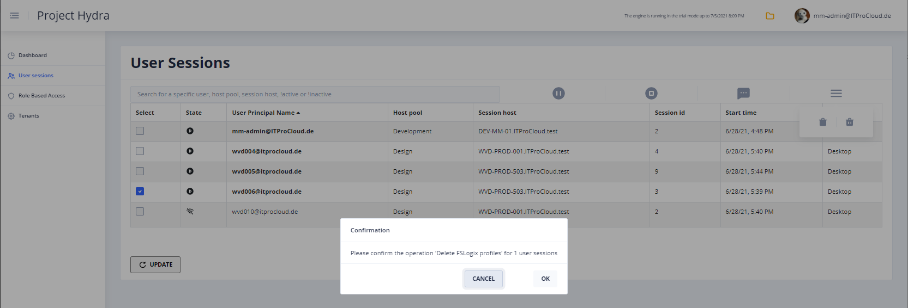

# AVD Hydra & WVD-Hydra

[Get it from the Azure Marketplace](https://azuremarketplace.microsoft.com/marketplace/apps/itprocloudgmbh1628775137215.hydra-deploy-d1)

[Get free support for the deployment](mailto:info@itprocloud.com)

## Terms

"Hydra" is a solution to manage Azure Virtual Desktop (Azure Virtual Desktop) for one or more tenants. It's a working solution and can be installed in any subscription. The solution can be used at your own risk and without the right of indemnity. However, I am trying to publish the preview releases in high quality.

The project is available as a **free community edition, even for commercial use** (up to 6 session hosts per host pool and a single tenant) and as a supported licensable product ($2 per concurrent user/month). Hydra will generally work without limitation for the first 30 days and switched to the community edition. Please reach out to extend the trial period or to get a commercial offer.

The owner of this solution is ITProCloud GmbH, [info@itprocloud.com](mailto:info@itprocloud.com).

Please make sure to send feedback and update the solution regularly.

## Get help

If you are not familiar with the first configuration and creating a service principal in Azure, write us a mail to give you free support: [info@itprocloud.com](mailto:info@itprocloud.com)

## Features

- Multi-tenancy
- Role-based access
- Management of user sessions
  - Logoff, messages, shadow user sessions, delete [FSLogix profiles](#Delete-FSLogix-profiles-from-the-user-sessions-menu)
- Management of session hosts
  - Start, Stop, Delete, Restart, Automatically change disk types
  - Create new session hosts with a click (with classic disks or ephemeral)
  - Create new session hosts directly into the drain-mode
  - Automation scripts and script collections
- Autoscale
  - Multi-Session hosts
    - Power-on-connect support
    - Schedules
    - Autopilot: Automatically scales up/down/create/remove based on the usage of a host pool
    - Deploy hosts on demand - including ephemeral VMs based on a custom image
	- Delete and rebuild hosts after logoff
  - VDI
    - Auto deallocate session hosts
- Session Timeouts
- Session host definitions for rollouts
  - Per host pool
  - Images and shared images
  - Copy configuration
- Auto Health
  - Remove orphan sessions
- Automatic disk change
  - Disk size is automatically changed on start/deallocation based on the VM tag "WVD.AdvDiskType", e.g., "Premium_LRS" will change the disk type to premium on start and to hdd after deallocation
  - From version 1.0.0.6: Can be configured on the host pool level
- [Scripts and Script Collections](#Scripts-and-Script-Collections)
  - Run Powershell scripts on session hosts
  - Orchestarte hosts with multiple scripts and tasks: Drain mode on -> Logoff users -> Start the VM -> Run a script -> Restart -> Drain mode off
  - Built-in scripts/collections for Windows Update, Windows 10 optimization, ...
- ...

## Updates and releases
Hydra can be easily updated from GitHub. Open the deployed app service -> Deployment Center -> click on "Sync"
- 1.0.1.14	(2021/09/13)
  - Fix/Add: Handle option "FlipFlopProfileDirectoryName" for FSLogix profiles
- 1.0.1.13	(2021/09/13)
  - Add: Memory optimization for larger environments
- 1.0.1.12	(2021/09/04)
  - Add: Watchdog for the worker process, improvement of the deployment of Hydra
- 1.0.1.11	(2021/08/26)
  - Fix: If prediction in autoscaling is disabled, under some circumstance, the value "Min. number of available sessions" was ignored
- 1.0.1.10	(2021/08/25)
  - Add: User list shows the disconnected time of users; Add: Azure AD Join + MEM (Intune join) is available
- 1.0.1.9	(2021/08/24)
  - Add: For shared host pools - Autoscaling: Delete and rebuild hosts after logoff - If a rollout profile exists and the last user has logged off from a session host, the session host will be deleted, and a new one will be rolled out (test carefully)
- 1.0.1.8	(2021/08/24)
  - Fix: In some circumstances deallocating a session host shows an error while the host deallocates correctly
- 1.0.1.7	(2021/08/16)
  - Add: Change: Change the rollout process to be more reliable if you deploy a lot of hosts at once; Fix: Secrets can now have special characters
- 1.0.1.6	(2021/08/08)
  - Add: Scripts and script collections can be triggered by schedules on a host pool level (e.g., to automatically update Windows across a host poll Sunday morning, ...)
- 1.0.1.5	(2021/08/05)
  - Add: Scripts and script collections are available to manage session hosts. Can be applied after a rollout of a new host or by selecting session hosts and a script/collection or with a schedule on the host pool level; Fix: Some fine tunings, like session timeouts, performance, etc.
- 1.0.1.4	(2021/07/04)
  - Add: Action log is now repeatable (GUI integration coming soon) and encrypt given secrets
- 1.0.1.3	(2021/07/01)
  - Fix: Change of an icon and rendering of a table in the schedule configuration
- 1.0.1.2	(2021/07/01)
  - Improvement of displaying the time chart in the host pool
- 1.0.1.1	(2021/06/30)
  - Deploy new session host in drain-mode (optional)
- 1.0.1.0	(2021/06/28)
  - Delete [FSLogix profiles](#Delete-FSLogix-profiles-from-the-user-sessions-menu) from the user sessions menu
- 1.0.0.9	(2021/06/24)
  - Deployment tags can be configure on a per host pool level
  - Note: The update removes the temporary stored session statistic for the last 12 hours (once to create an index to show the data faster)
- 1.0.0.8	(2021/06/18)
  - Auto health can be configured on the host pool level for orphan sessions
- 1.0.0.7	(2021/06/17)
  - Bugfix: 'Auto-change disk type' can now be disabled
- 1.0.0.6	(2021/06/16)
  - 'Auto-change disk type' can be configured on the host pool level (base settings) to switch to disks to SSD/Premium on start and HDD after deallocating (saving money for the storage)
  - Autoscale schedules can now include serving a minimum number of free sessions.
- 1.0.0.5	(2021/06/15)
  - Role-base access and mirroring of user sessions (click on the play icon in the user overview of an active session)

## Installation

Use the "Deploy to Azure" button to roll out your instance of Project Hydra into your subscription.

<a href="https://youtu.be/GaRrotF0peM" target="_blank">See the installation and basic configuration on YouTube</a>

During the deployment, you have to enter the following information:

- Basics

  - Subscription
  - Resource group
  - Region
  - Name of your deployment: That name becomes the hostname of the hydra-portal e.g., "myhydrainstance.azurewebsites.net". The name must be unique for some resource types. Press "Tab" to let Azure check the availability of the name

- Service Principal

  - A (web) service principal is needed to let users log in to the hydra-portal website. Create the service principal with the PowerShell script in the Cloud Shell. Copy the following data into the fields: 
  - Application Id
  - The secret of the service principal and Confirm secret.

- Administration

  - Add the UPN of the master administrator into the field. You can add multiple administrators separated with a comma. These users have full access to the solution and can add other users with specific permissions in one of the following updates.

- Tags

  - Are optional to tag the resources

After that, click "Create" to install your instance of Project Hydra into your subscription. The deployment will take some minutes.

## Adding a tenant

***Note:** If you are not familiar with the first configuration and creating a service principal in Azure, write us a mail to give you free support: [info@itprocloud.com](mailto:info@itprocloud.com)*

Open your Project Hydra instance in a web browser by entering https://myhydrainstance.azurewebsites.net (myhydrainstance is the name of your deployment from the basic step).

Log in with the user you have entered in the administration step (Administrator(s) of the solution). Note: You can change this setting on the deployed app service -> Configuration -> Application settings -> "config:Administrators")

Click "Tenants" and "Add" to add your first or a new tenant. Next, you need a service principal to give Project Hydra access to the WVD resources in the tenant. A service principal is like a functional account that is used for the Hydra engine to log in and access the resources.

You can use **[WVDAdmin](https://blog.itprocloud.de/Windows-Virtual-Desktop-Admin/)** credentials if you have or create a new service principal:

- Open [https://portal.azure.com/#blade/Microsoft_AAD_IAM/ActiveDirectoryMenuBlade/RegisteredApps](https://portal.azure.com/#blade/Microsoft_AAD_IAM/ActiveDirectoryMenuBlade/RegisteredApps)

- Click "New registration"

  - Enter a name for the service principal, e.g., "svc-Hydra_Engine"
  - Click "Register"

- Click "Certificates & secrets"

  - Click "New client secret"
  - Select an expiration date, e.g., 18 month
  - Click "Add"
  - Directly copy the value (the secret) for later use

- Click "Overview"

  - Copy the following data to configure the service principal in Project Hydra

    - Directory (tenant) ID -> Tenant id
    - Application (client) ID -> Application id
    - The secret from the previous step -> Secret

Before you complete the configuration in Project Hydra, go to your Azure subscription and add the created service principal with contributor permissions to the subscription or all resource groups containing your WVD environment (VMs, host pools, images, v-net, ...). 

Go back to the configuration and give your new tenant configuration a display name and check "Enabled". You can test the service principal by clicking "Test primary". After that, click "Save". Please reload the website after a few minutes to see your environment in Project Hydra.

## Scaling

Scaling can be essential in a WVD environment regarding the costs. For example, running virtual machines costs money - independent if users are connected or not. Additionally, the storage costs 24/7 - even for a deallocated virtual machine. Typically in WVD, the number of user sessions changed from time to time, and in a best-case, the number of running session hosts correspondent to the actual count of user sessions.

Hydra can scale pooled session hosts (multi-session) and persistent (VDI) host pools in a very smart way - like an autopilot for host pools. And: It can create temporary session hosts on demand if needed and delete them later, saving costs for the non-existing virtual disks.

### Scaling of pooled host pools

A pooled host pool should have always had enough running session host to provide capacity to host the upcoming users (but not more) or should use Power-on-Connect to start the first session host while a user begins the connection.

While hydra autoscaling and autoshutdown works perfectly with Power-on-Connect, I recommend [enabling this feature](https://blog.itprocloud.de/Custom-Role-for-Power-On-Connect-Preview/). Additionally, Power-on-Connect allows deallocating all session hosts if no user is connected.

***Dashboard -> Three dots icon (configuration) on the host pool -> Autoscale & Autoshutdown***

Enable the configuration and configure the basic settings:

- Use Power-On-Connect (preview feature):
  Check this (and configure Power-on-Connect) to bring the host pool down to zero session hosts
- Session hosts running 24/7:
  With Power-on-Connect you can go down to 0. If you have reserved instanced, it is a good option to let some session hosts running permanently (users don't have to wait for the start of a session host)
- Default Loadbalancer Type:
  Should be "Depth-First"
- Min. number of available sessions:
  A minimum amount of a free session capacity. If you set it to 5 then always enough session hosts are available to host 5 more sessions. 0 is the most cost-saving value (brings the host pool down to zero session hosts)
- Min. number of hosts without sessions:
  A minimum amount of session hosts without user sessions. 0 is the most cost-saving value (brings the host pool down to zero session hosts)
- Temporarily rollout new session hosts up to a max. number of hosts in the pool:
  If a default rollout profile is configured, autoscale can create new session hosts if needed. This configuration limits the total amount of session hosts in the pool. Temporarily created session hosts will be removed automatically if no longer needed. Note: Power-On-Connect cannot trigger the creation of a new session host
- Concurrent starts/rollout of session hosts at the same time:
  Limits the number of parallel starts/creation of session hosts. In a huger environment, increase this value to start more session hosts at the same time

Additionally, you can configure schedules to have several session hosts running in the peak time of the logons (e.g. between 7:00 am and 9:00 am). Hint: You don't need to cover the working hours - if more session hosts are needed, autoscale will start or create new hosts (like an auto-pilot).

Add a new schedule and configure:

- Min. Hosts:
  The min. number of hosts running in the time frame. If fewer hosts are running, autoscale will start/create additional hosts
- Min. Free Sessions:
  Optionally: Minimum number of available (free) sessions during the schedule. The engine keeps care that enough session hosts are running to handle this number of new sessions (the engine will start additional hosts)
- Weekdays, from, to:
  The time when this schedule is active
- Load-Balancer: 
  You can change the load-balancer type for the time frame to breadth-first to spread the logons around all available session hosts. That increases the performance dramatically in a logon-storm-phase
- Build-First:
  If a default rollout profile is configured, you can use this option to temporarily roll out a new session host to reach the minimum level of hosts for this time frame. Temporarily created session hosts will be removed automatically if no longer needed. Note: This is a great option with Power-on-Connect: Let the engine create 60% of the needed hosts in the morning and left the existing host deallocated for Power-on-Connect
- Note: Configure the time zone of the host pool in the "Base" tab

**Pro-Tip:**

- Create a default rollout profile in the "New session host rollout" tab and test it 
- User Power-on-Connect to bring down the host pools to 0 hosts
- Have several session hosts deployed permanently to (with Hydra or WVDAdmin). These hosts are proposed to start them if new hosts are needed (starting is faster than creating)
- Use a schedule to provide temporarily created hosts in the rush hour (typically in the morning). These hosts will be deleted if no longer needed (and that saves the costs for the non-existing disks as well)
- Configure "Session Timeouts" to log off disconnected sessions

**Pro-Pro-Tip:** 

- Use ephemeral disks for more saving and higher performance)

**Example:**

### Scaling of persistent host pools

A persistent host pool contains assigned session hosts for named users. A user can start the session hosts directly with the WVD client: If the session host is deallocated, a click to the desktop icon will start the session host using the [Power-on-Connect](https://blog.itprocloud.de/Custom-Role-for-Power-On-Connect-Preview/) feature.

To deallocate unused hosts automatically, configure "Autoscale & Autoshutdown" in Hydra:

***Dashboard -> Three dots icon (configuration) on the host pool -> Autoscale & Autoshutdown***

Add a new schedule and configure:

- Timeouts in minutes:
  The time after an unused session host will be deallocated
- Weekdays, from, to:
  The time when this schedule is active
- Note: Configure the time zone of the host pool in the "Base" tab

**Example:**

The example shutdown unused session hosts after 20 minutes for every day and time in a week.

Note: 

- You can add multiple schedules for different times
- Configure "Session Timeouts" to log off disconnected sessions
- Only session hosts without sessions are deallocated after the timeout

## Session timeouts

Session timeouts a very helpful to log off disconnected sessions fast. Disconnected sessions are log out automatically after a timeout. That is important to allow autoscale to deallocate session hosts. You can define different timeouts based on the weekdays and times (like in the example below):

***Dashboard -> Three dots icon (configuration) on the host pool -> Session Timeouts***

Add a new schedule and configure:

- Timeouts in minutes:
  The time after a disconnected session will be deallocated
- Weekdays, from, to:
  The time when this schedule is active
- Note: Configure the time zone of the host pool in the "Base" tab

**Example:**

For the example, disconnected sessions will be logged off:

- Mo-Fr between 7:00 am and 8:00 pm, after 120 minutes (working hours, enough time to have a lunch or a meeting)
- Mo-Fr outside 7:00 am and 8:00, after 20 minutes
- On the weekend, after 20 minutes

Note: 

- You can add multiple schedules for different times
- Session timeouts work for pooled and persistent host pools

## Delete FSLogix profiles from the user sessions menu

Users and administrators with the role ***User and profile manager*** or higher can delete FSLogix profiles in two ways:
- Select the users -> Burger menu ->Delete FSLogix Profile (left)

  - The users are logged off, and the FSLogix profile will be deleted from the storage

- Burger menu ->Delete FSLogix Profile (left)

  - Select a host pool and enter the user names (UPN, e.g., user1@contoso.com;user2@contoso.com) into the text field

In both cases, the profiles are deleted from the storage account. The profile path is read from one available session host in the host pool.

**Prerequisites:**

- Enter a service account of your local AD domain into the basic setting of each host pool where you want to use this feature. The service account is used to authenticate to the storage account, NetApp files, etc., and needs proper permission to delete files.
  - Hint: For Azure Files, give the service account *"Storage File Data SMB Share Elevated Contributor"* permission on the storage account. Note: That can take a while. I made progress after creating one folder on the share in the context of the service account.
- An available session host in the selected host pool

## Scripts and Script Collections

Scripts and script collections. Both are intended to automize Azure VMs, and Azure Virtual Desktop (AVD) from the management perspective.

### Script

A Powershell script for a session host. The script runs in the system context with system permissions, variables containing data about the host pool, session hosts, etc. Optionally, a Powershell credential object (PSC) can be used to connect to other services, like files shares (the service account can be configured on the host pool level).

### Script Collections

A script collection is a collection of scripts and tasks in any sequence. E.g.: Drain mode on -> Logoff users -> Start the VM -> Run a script -> Restart -> Drain mode off

Additionally, parameters can be set for a script, and error handling is built-in. Script collections are very useful to orchestrate several tasks and scripts to session hosts.

### Built-in scripts and collections

There are several built-in scripts and collections, and new scripts and collections are provided continuously. Built-in scripts can be updated with the "Update" button in the upper-right corner.

To add a custom script or script collection, copy the *"BuiltIn: 1st Template Script"* or *"BuiltIn: 1st Template Script Collection"*. Then start building the new one. Make sure to save the new script/collection with a click of the disk symbol. There is no warning right now if you close the browser or if you navigate to another site.

### Triggering a script or script collection

Scripts and script collections can be triggered by *Host pool administrators* and edited by *Full administrators*.

Both can be assigned/triggered in different ways:

#### For selected hosts

#### Automatically after the rollout of a new session host

#### By a schedule

Schedules can be used on a host pool level to run a script or collection unattended on session hosts of the pool. Comparable to other schedules, weekday(s) and start time define the plan. The following parameters can be used to fine-tune the schedule:

- Hosts

- - Run on all hosts
  - Run only on hosts without user sessions
  - Run only on hosts in drain-mode

- Simultaneously

- - Starts directly on all hosts
  - Start on max. 5 session hosts at the same time (if one finished, the script/collection will be started on the next host)
  - ...

This example runs Windows Update on all session hosts Sunday, 1:00 am. Including drain mode, start, update, restart, drain mode off.

