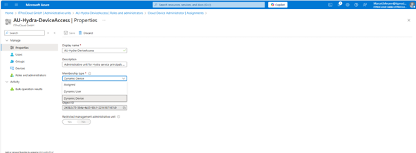
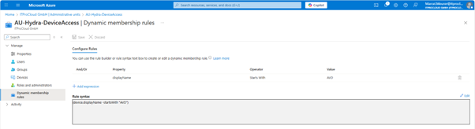
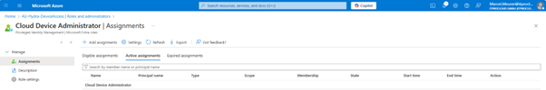
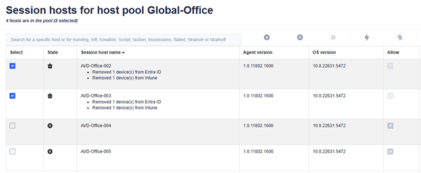

# Configure Hydra to remove Entra and Intune devices
You can only deploy new hosts in Entra ID if no device with the same name exists in Entra.

There are two primary approaches to automating the removal of Entra and Intune devices via Hydra:

The first - and generally safer - method leverages the VM's own identity to perform deletion. Here, you configure a script to execute within the virtual machine itself. When the VM is scheduled for deletion, this script authenticates using the VM's credentials and requests the removal of its device object from Entra. [Read more](https://github.com/MarcelMeurer/WVD-Hydra?tab=readme-ov-file#aad-only---join-and-re-join-hosts)

The second method involves granting Hydra’s service accounts or managed identity additional permissions at the directory level and in Intune. With these broader rights, Hydra can centrally remove corresponding Entra device records (and, if desired, matching Intune device entries) whenever a VM is deleted and before a new deployment to prevent potential conflicts. This central management might simplify administration, but it means the Hydra service has elevated permissions, which may be less desirable from a security perspective. 

## Adding administrative permissions
### Device Administrator role on an administrative unit
An additional way to enhance security while still enabling automated device removal is to scope Hydra’s permissions more narrowly using Entra’s administrative units. Instead of granting directory-wide rights, you can assign Hydra the “Cloud Device Administrator” role specifically for an administrative unit that contains only the relevant devices. By organizing Entra devices into an administrative unit based on a naming convention - such as all devices with names starting with “AVD” - you ensure that Hydra’s elevated permissions apply solely to those matching devices. This targeted approach limits the impact of Hydra’s access, allowing it to manage only the intended subset of Entra devices while maintaining tighter overall security.

Goto Entra in the Azure Portal -> Administrative units

 
Click “Add” and enter a matching Name like “AU-Hydra-DeviceAccess” and a description.

 
Assign the role “Cloud Device Administrator” after clicking on “Next”.

 
Create the new administrative unit. The new unit shows up after a few minutes.

 
Edit the unit by clicking on its name. Navigate to properties and select the “Membership type” “Dynamic Devices”:

 

Click “Add dynamic query” to narrow down the permission of the role to specific devices only. You can filter the devices by name starting with (e.g.) “AVD”. In this case, the administrative units narrow down the permissions to devices starting with the name “AVD....”.

 
Click on “Roles and administrators” and then on “Cloud Device Administrators”.
 
 
 
 

Click on “Add assignments”. The selected scope is the administrative unit focusing on the devices starting with AVD. Click “Select member(s)” and your Hydra service principal(s) (from the tenant menu in Hydra) or managed service identity if you are using this one.

 
Click “Select” and “Next”. In the following dialog, choose “Active” and “Permanently assigned” (not shown in all tenants). Enter a justification and select “Assign”.

Hydra now has the administrative role for the devices in the administrative unit. 

### Graph API permissions
The Hydra service principal(s) need additional permission to find the devices in Entra (before removing them from the configuration). 

Open the Azure Portal, navigate to Entra -> App registrations and search for the first service principal of Hydra in “All applications”. You can also search for the ID of the service principal. You can find the ID in the tenant configuration of Hydra.

Select the service principal and select “API permissions” in “Manage”:

**Remove Entra devices**
Add the following permissions by clicking “Add permissions”.

|Part|Value|
|---|---|
|API:|Microsoft Graph|
|Type:|Application permissions|
|Permission:|“Device.Read.All”|

**Remove Intune devices**
To let Hydra also remove Intune devices, add the permission:

|Part|Value|
|---|---|
|API:|Microsoft Graph|
|Type:|Application permissions|
|Permission:|“DeviceManagementManagedDevices.ReadWrite.All”|

**Note:** This permission is valid for all (!) devices in Intune and cannot be narrowed down like the Entra devices. Use it carefully and monitor your environment, probably. Use private endpoints for Hydra and disable public access to the Hydra app service.

**Allow Hydra to show users and groups**
Hydra can display users and groups in the directory for various purposes, such as assigning a user or group to an application group in AVD. To allow that, add the following permission:

|Part|Value|
|---|---|
|API:|Microsoft Graph|
|Type:|Application permissions|
|Permission:|“Group.Read.All” and “User.ReadBasic.All”|

**Note:** This permission is valid for all users and groups. Use it carefully and monitor your environment, probably. Use private endpoints for Hydra and disable public access to the Hydra app service.

**Giving admin consent**
The added permissions need consent from a privileged administrator and shown as “not granted” in the status field:

Clicking “Grant admin consent for company” starts the consent process. After the completion, the service principal has the permissions:

**Additional service principals**
Repeat this step for each service principal you are using in Hydra (listed in the tenant configuration of Hydra).

**Managed Service Identity**
PowerShell is needed to give the MSI the API permission, like in the configuration of the service principals.

## Configure a host pool to remove Entra and Intune devices on demand
Go to the host pool configuration of a pool -> New session host rollout

Enable the following checkbox or checkboxes to allow Hydra to remove devices on a delete event and on rollout (if devices with the same name exist).

 
**Be careful:** 
Please note that an administrator in Hydra could potentially specify the name of an existing Intune device, which is not an AVD device, thereby causing it to be deleted unintentionally.
Example for a deletion process with Entra and Intune devices:
 
## Example of a deletion with devices

