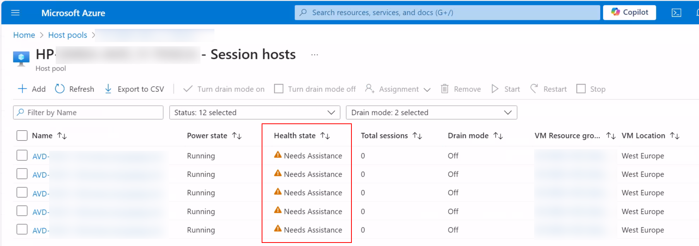
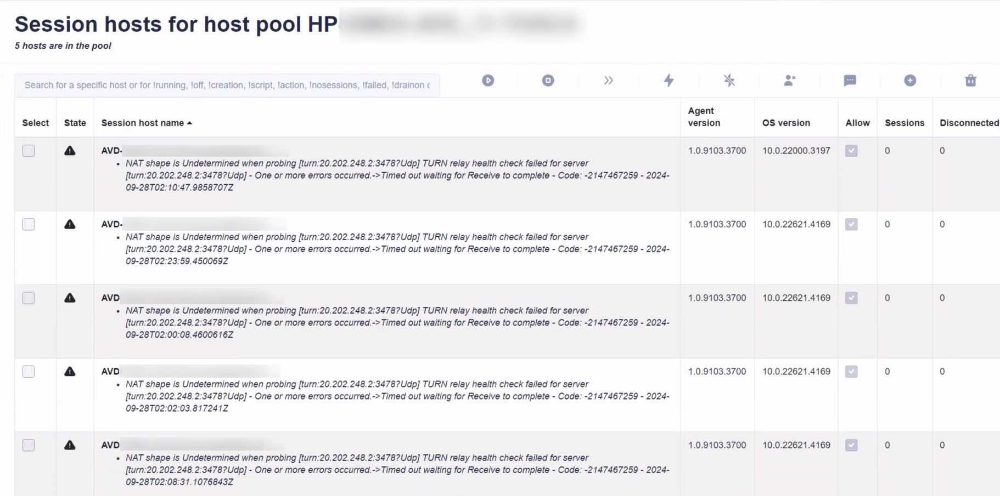
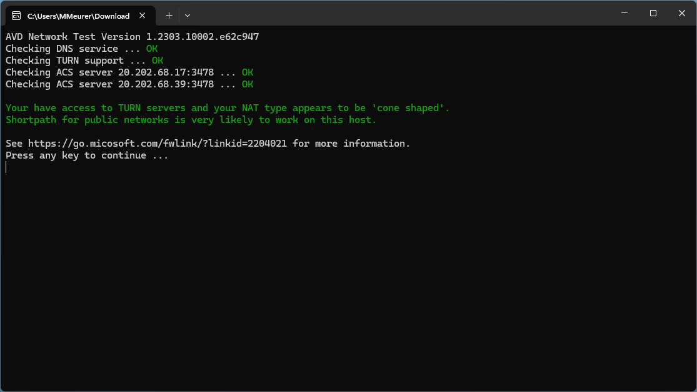

# Current issues: AVD agent reports an issue and brings the hosts into **"Need Assistance"**

Today, I got a lot of emails and team messages. Customers are seeing the following error message on session hosts in the Azure Portal and in Hydra:

3
> NAT shape is Undetermined when probing [turn:20.202.248.2:3478?Udp] TURN relay health check failed for server [turn:20.202.248.2:3478?Udp] - One or more errors occurred.->Timed out waiting for Receive to complete - Code: -2147467259 - 2024-09-26T07:39:15.704086Z

The session hosts are also going into the **"Need Assistance"** mode - even if users can still log in and continue working. It's also reported, that the time stamp of the error message stays.

The issue is related to the AVD agent testing a UDP connection to the given (Microsoft) IP. This is a normal behaviour and can fail if customers are not allowing this connection through the firewall. If that is not working, connections are made via TCP. So far - so good. Unfortunately, the AVD agent shows this as an error, bringing the host into the **"Need Assistance"** mode.

**Important: Session hosts in this state do not count on the capacity of a pool in Hydra. It also can break autoscaling if you run Hydra version 1.0.8.7 or less. Also hosts in this state are **not** deallocated automatically - they stay running until the error disappears.**






## What can we do?


### Allowing UDP communication to specific ports (preferred)
You can configure the firewall to allow communication to the mentioned ports if that is an option for your environment/company. In short, the following communication from the hosts to the internet must be possible:
- Target: 20.202.0.0/16, Port 3478 UDP
- Target: 20.202.0.0/16, Port 443 TCP
- [Link to the blog post](https://learn.microsoft.com/en-us/azure/virtual-desktop/rdp-shortpath?tabs=public-networks)

You can test the connection with the tool [avdnettest.exe](https://learn.microsoft.com/en-us/azure/virtual-desktop/troubleshoot-rdp-shortpath) from Microsoft:


<br/>

### Update Hydra (also preferred)
There is a new release of Hydra available from 09/30/2024 (v1.0.8.7) containing a hotfix to handle failed hosts. This will not remove the error message but should show the correct sessions and handle autoscaling also for hosts in the **"Need Assistance"** mode. Please monitor your environment after update/hotfix: [How to update Hydra](https://github.com/MarcelMeurer/WVD-Hydra?tab=readme-ov-file#updates-and-releases)
<br/>

### Disabling UDP temporary (workaround)
If option one is not possible, or the error messages are not disappearing, we can disable the use of UDP [via GPO](https://admx.help/?Category=Windows_10_2016&Policy=Microsoft.Policies.TerminalServer::TS_SELECT_TRANSPORT) or reg keys. The following script disables UDP, and it should also remove the error message. You can [create the script in Hydra](https://github.com/MarcelMeurer/WVD-Hydra/blob/main/README.md#scripts-and-script-collections) and run it on the hosts (test it with one host first):

```
New-ItemProperty -Path "HKLM:\SOFTWARE\Policies\Microsoft\Windows NT\Terminal Services" -Name "SelectTransport" -Value 1 -force # default: 0

# Reset old failure state
if (Test-Path -Path "HKLM:\SOFTWARE\Microsoft\RDInfraAgent\HealthCheckReport") {
    Remove-ItemProperty -Path "HKLM:\SOFTWARE\Microsoft\RDInfraAgent\HealthCheckReport" -Name "AgentHealthCheckReport" -ErrorAction SilentlyContinue
    Remove-ItemProperty -Path "HKLM:\SOFTWARE\Microsoft\RDInfraAgent\HealthCheckReport" -Name "AgentHealthCheckTimestamp" -ErrorAction SilentlyContinue
}
```
If you rollout a new host, make sure to reapply this settings. That can be done in Hydra -> Host Pool -> New Session Host Rollout -> Run script or script collection after deployment
<br/>

---
It's also a good idea to open a ticket to let Microsoft fix this issue with the service/AVD agent.

---
For questions or support, please send an email to (please accept some delays): support@itprocloud.com.

