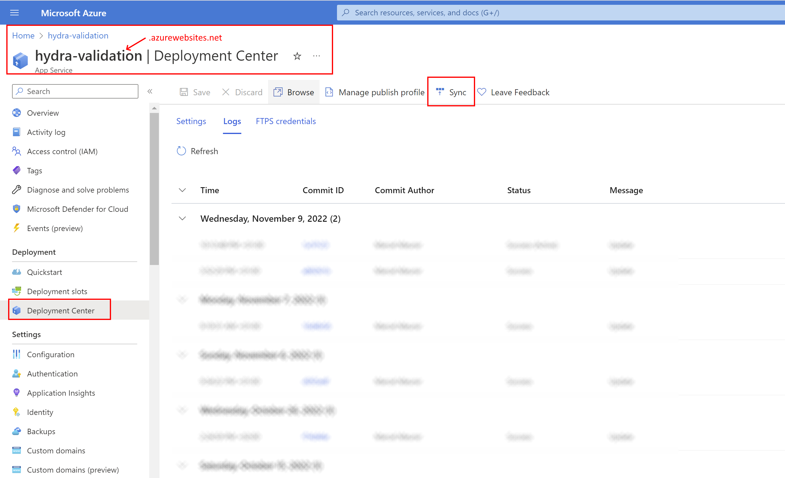
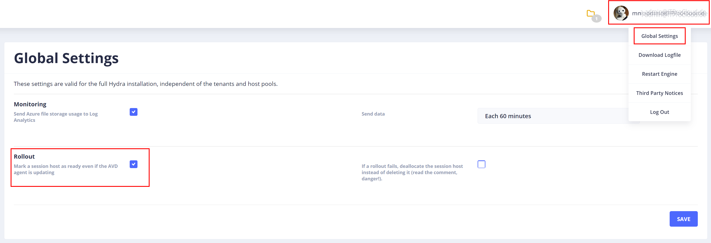

# Rollout issues: AVD Agent 1.0.5555.1008 and newer are causing high timeouts for upgrading themselves. That can cause rollout issues with Hydra.

Due to the new AVD agent from Microsoft, two actions are recommended not to show timeouts when rolling out new session hosts. This will likely occur during the next rollout or after a new image is created:

## 1) Update Hydra for Azure Virtual Desktop.
The update is simple via the App Service -> Deployment Center -> Sync. Please only do this when no active tasks (deployments) are running.

## 2) Configuration: Mark, a session host as ready even if the AVD agent is updating.
Optional: This will directly consider the rollout of new session hosts as complete, even if the AVD agent is still updating. The Global Config can be accessed: Avatar image next to the name in the upper right corner -> Global Settings.

# Background
Microsoft's new AVD agents (from version **1.0.5555.1008 and newer**) have a high timeout, which updates itself directly after installing new hosts. Unfortunately, this upgrade almost always takes a little longer than 30 minutes. The behavior has been confirmed and described by design for this and possibly upcoming agents. By default, Hydra waits after a rollout for the host to be seen as "Available". Due to the long upgrade time of 30 minutes, Hydra in the version before 1.0.1.78 assumes that the rollout has failed and removes or deallocates affected hosts. Therefore, the current Hydra version has a higher timeout and waits longer for the session host. Optionally, by configuring 2), Hydra will complete the rollout even if the AVD agent upgrades itself.
Due to the AVD agents, it takes much longer to roll out new hosts completely. Please do not manually shut down hosts in upgrading status.

For questions or support, please send an email to: support@itprocloud.com.