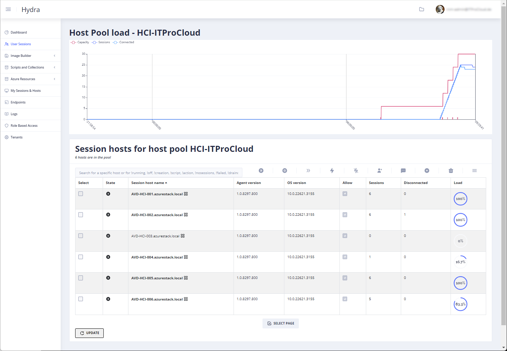
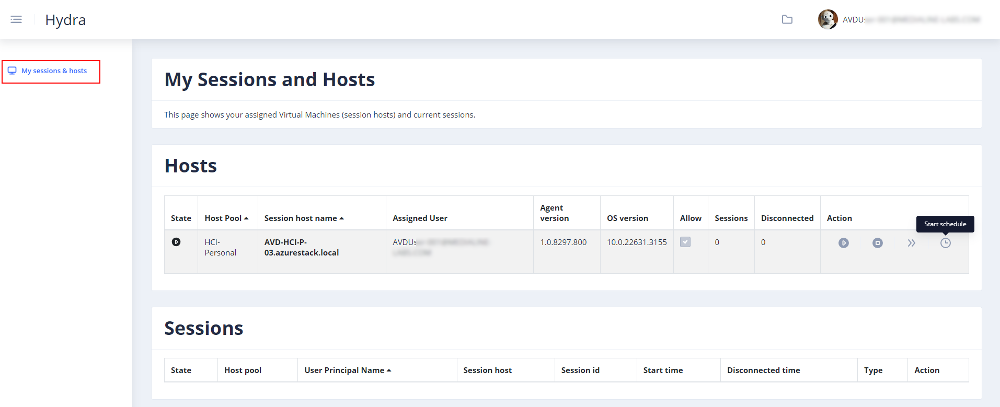
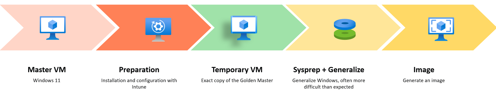
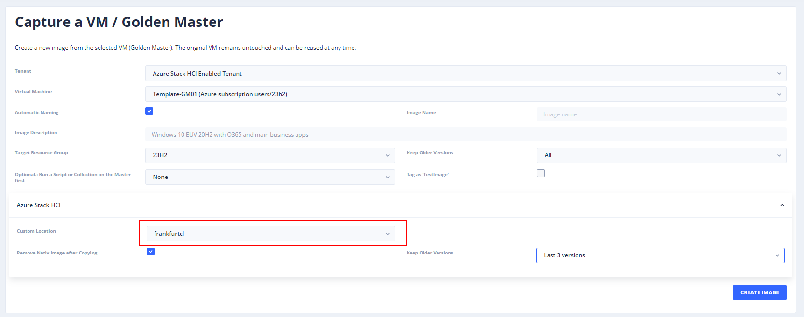
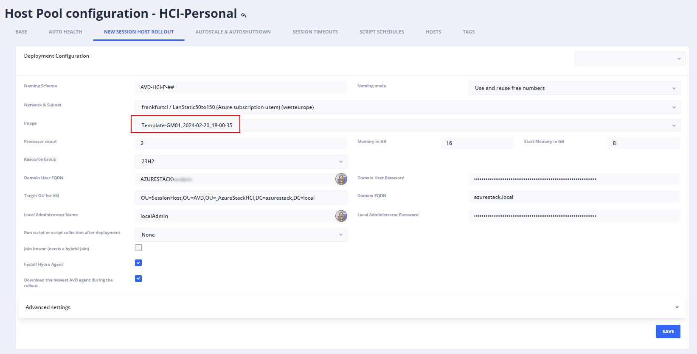

# Manage Azure Virtual Desktop on Azure Stack HCI with Hydra for Azure Virtual Desktop

Hydra is the one-stop solution for managing and operating AVD in a clever and easy way. Hydra supports administrators in managing user sessions, creating images without losing the Golden Master, deploying and re-deploying session hosts, and automating daily tasks with a powerful and easy-to-use engine. This and much more for single and multiple tenants.

Right now, starting from version 1.0.6, Hydra supports hosts on **Azure Stack HCI 23H2**. Does mean you can leverage the feature set of Hydra to handle hosts on HCI in mostly the same way as hosts in Azure:
-	Autoscaling of pooled and personal host pools
-	Let user start their personal hosts
-	Create images from Azure VMs and store them in a custom location (on HCI)
-	Create multiple hosts with a click
-	Replace hosts with hosts based on an updated image
-	Automat the daily tasks with scripts and collections
-	Handle user sessions independently from the host type (HCI vs. Azure VM)
-	Using the Hydra agent to show and terminate processes
-	…

Autoscaling is especially important, while Microsoft announced **charging 1 US cent per core and hour** for a running host on HCI. Additionally, the self-service for users of personal hosts is nice as well, while power-on-connect is not available for HCI right now.

## How does Hydra integrate hosts on HCI
There is no need for a special configuration. If Hydra reads a custom location in Azure, it automatically offers the networks in the location as a target to roll out new hosts. Existing hosts on HCI are also automatically handled by Hydra. The only **requirement is Azure Stack HCI 22H3** with a configured resource bridge.

Finally, there is nearly no difference between hosts in Azure or on HCI for Hydra. Theoretically, a host pool can contain both types of hosts (if it makes sense). The difference between both types of hosts is the location/custom location.

And yes, some configurations are unavailable for HCI hosts, like switching the disk types.

## How to configure autoscaling
Autoscaling works in the same way as hosts in Azure. Follow the documentation to configure autoscaling: [https://github.com/MarcelMeurer/WVD-Hydra?tab=readme-ov-file#scaling](https://github.com/MarcelMeurer/WVD-Hydra?tab=readme-ov-file#scaling)

As shown in the screenshot, Hydra starts session hosts automatically before users try to log in. And in the other direction, if users are logging off at the end of the work day.
 

Please note that Power-On-Connect is not working for HCI right now.

## How to give users access to start their personal hosts
Give users or a user group the role "User" in Hydra. After this, users can access Hydra and only see the menu item "My Sessions & Hosts". From this, users can start/stop/restart the personal hosts or log off their sessions. 

## How to create a custom image and do a roll out
Creating images based on a "Golden Master" is one of the strengths of Hydra. Compared to a manual approach, Hydra always runs the imaging process of a clone of the Golden Master. This is important to avoid that sysprep destroying the Golden Master. So, with Hydra, administrators can use the original Golden Master to update and maintain the image the next time. The imaging process looks like this:

After creating the image, the clone is deleted during the clean-up.
Imaging for HCI works in the same way, but we must consider a few points right now:
-	We can only use an Azure VM as a master – not a VM on HCI
-	While we cannot use Trusted Launch for custom images in HCI, our Golden Master must have the **security type "Standard"**

We can create a custom image for HCI with the following steps:
- Create your Golden Master VM in Azure (not HCI)
   - Use a Windows 11 (multi-user) marketplace image
   - Security type: **Standard**
-	Login to the VM
-	Optionally: Join to an AD domain
-	Install Windows Updates
-	Install Applications
-	Go to the Hydra portal -> Image Builder -> Create an Image
-	Select your Golden Master VM
-	Select a Target Resource Group to store the Azure image 
-	In the section "Azure Stack HCI" select the custom location
-	Optionally configure the other two options
-	Click on "Create Image"
 
**Caution:** Never let Hydra delete an image that is being used by a virtual machine. VMs can no longer be started or stopped if the base image is deleted. Only deletion would work.
 

The VM will be cloned, and the image will be transferred to the custom location (that could take a while). After that, you can create new hosts in a host pool by configuring the rollout configuration in the Hydra settings "New Session Host Rollout" of the host pool:
 

Click on the plus icon in the session host list of a host pool to roll out hosts with the custom image.

## [See a short video on how to work with Hydra and Azure Stack HCI](https://youtu.be/ji6_pLhJVCY)

 
 <link rel=canonical href="https://blog.itprocloud.de/AVD-Hydra-For-Azure-Stack-HCI-Deplyoment-Management"/>