# Create a service account for an Active Directory domain join
Often, session hosts must still be part of an Active Directory domain to host applications depending on an AD environment. To join a host (which means a computer object) to AD, a service account with proper permission is needed.

Never use admin credentials for automating these kinds of tasks, and never store admin credentials in Hydra/WVDAdmin. Instead, use a service account with the least privileges necessary to perform this action.

## Create a service account for the domain join
Open Active Directory Users and Computers and select a proper OU to store the new service account. Right-click -> New -> User

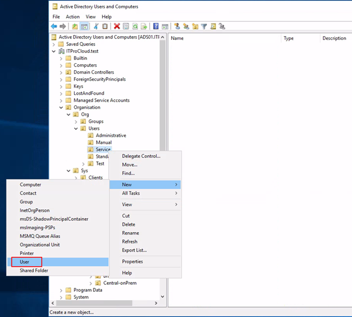
 
Enter a name for the service account. E.g., “srv-DomainJoin-AVD”

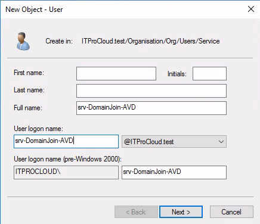
 
Enter a long and complex password for the account and tick both password options (PS: It makes sense to change the password regularly. If so, do this in AD and also in the configuration of Hydra/WVDAdmin).

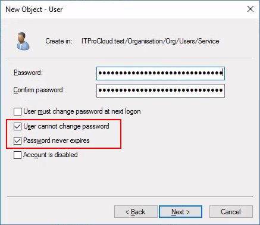
 
Finish the creation of the service account.

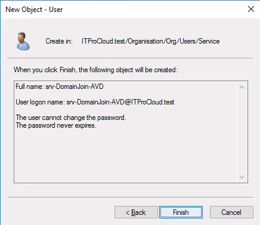

## Give the service account delegated permissions for the domain join
After you created one or more OU for your hosts/computer accounts, delegate the permission at the entry level for your computers. In my case, that is AVD-Hosts (I’m using OUs to separate the hosts by their host pools).

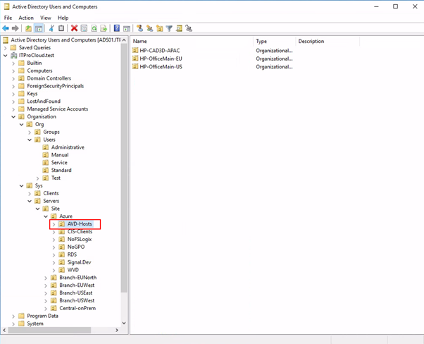 

Right-click -> Delegate Control...

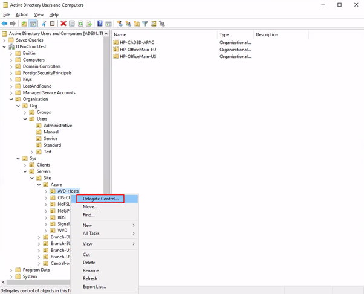
 
Next
 
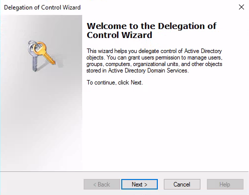

Click on “Add” and select the previously created service account.

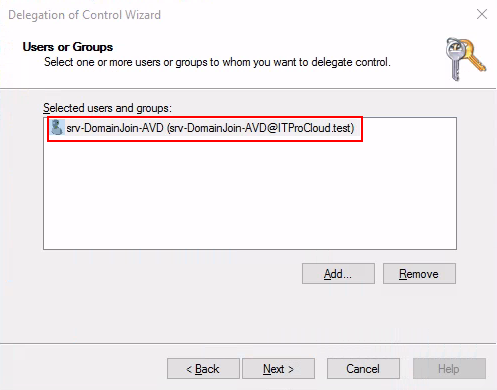
 
Next, select “Create custom task to delegate”.

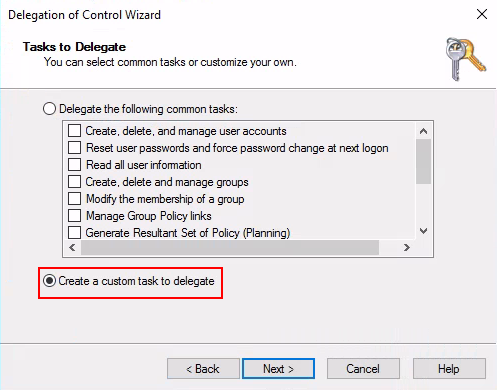

Select the proper options. Make sure to only do it related to the “Computer objects”:

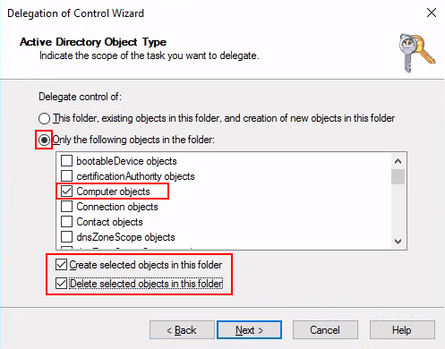

Next. Configure the selected options only:

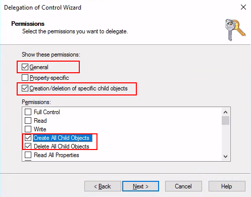

Next, and finish the delegation.

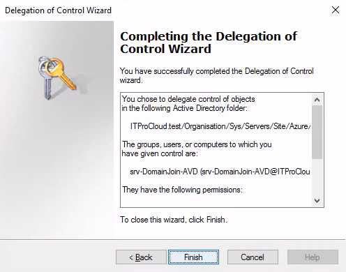

The service account now has the right permissions. Please regularly monitor the usage of the account.

## Add the service account to Hydra
Select properties of the OU where do you want to store the hosts/computer objects.

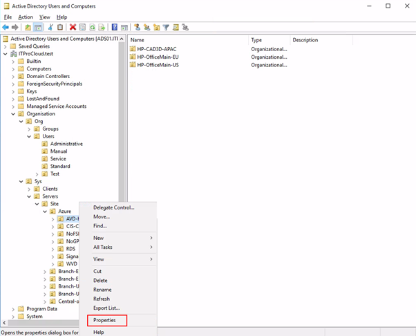
 
Select “Attribute Editor” and double-click on distinguishedName. You can now copy the OU path for later use:

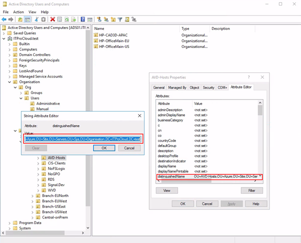

In Hydra, open the rollout configuration of a host pool and enter the data of the service account, domain, and OU path:

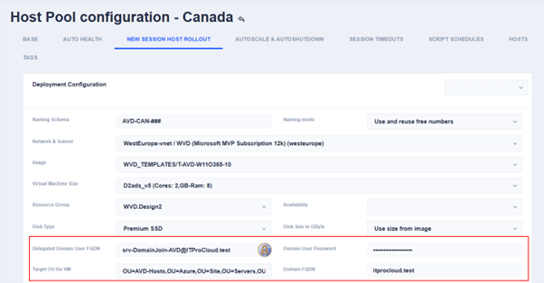

You are ready to go.

PS: You can increase the security by not allowing interactive logins for this user.

PPS: Never add this user into a group to extend permissions. The user is for the domain join only.