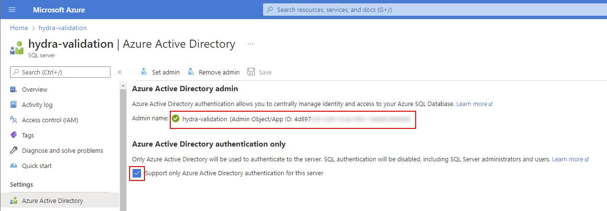

# Securing Hydra for Azure Virtual Desktop with Private Endpoints and Entra ID Database Authentication

## Default Deployment
Hydra is deployed by default without using private endpoints. That is to start easy with Hydra, even if the network configuration must be done bv another department. We strongly recommend to use private endpoints for the app service, Key Vault and Database and remove the exponation the the internet.

## Access the database with the identity of the App-Service (Entra ID)
If not already configured, we recommend to change the access to the database by using the app service identity (Entra ID). 

Do the following changes in a maintenance windows:
Open the SQL server resource in the Azure Portal -> Azure Active Directory  -> Set the managed identity of Hydra's web service as an administrator and check "Support only Azure Active Directory authentication for this server"

Change the connection string in the Key Vault (not needed for Hydra version 1.1.1.8 or higher). Open the Key Vault and give yourself permission (Access Policy) to change secrets. In secrets, copy the existing connection string from Hydra-DbConnectionString and modify it to match the following string:

Server=tcp:<my-database-server>.database.windows.net,1433;Initial Catalog=Hydra;Persist Security Info=False;Encrypt=True;Connection Timeout=90;

Remove the other parts of the string (like user id, ...). Add the new connection string as a new version. Optionally, remove your permission from the Key Vault.
Restart the app service and verify that the engine runs with the new configuration

## Using Private Endpoints
If you configure you Hydra installation to use private endpoints, you can avoid that the database and Key Vault is exposed to the internet. We strongly recommend doing this and it's already a "practice" for Azure applications using different resources, like SQL, KeyVault, etc.
You can find a description including a video at the [ITProCloud Blog](https://blog.itprocloud.de/Securing-an-app-service,-a-key-vault,-and-a-database-with-private-endpoints/)