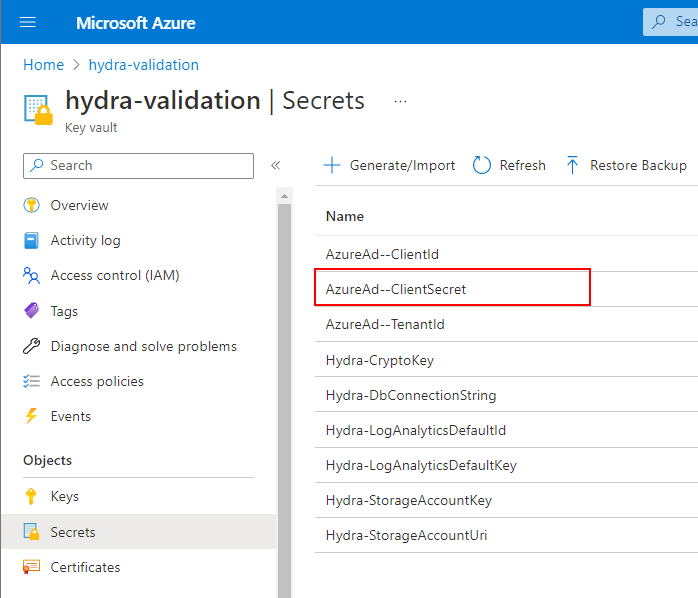

# Update the service principal/app registration secret of the Hydra portal (web app)

The Hydra Portal is based on an Azure App Service. To identify users, a service principal/app registration was created during the rollout (by using the PowerShell script) in the second step during the rollout. 

Service principal/app registration secrets have a limited validity period (up to two years). If a secret is invalid, logon to the Hydra portal is no longer working. Administrators or users trying to logon get the following error message from Azure AD:

*AADSTS7000222:  InvalidClientSecretExpiredKeysProvided - The provided client secret keys are expired. Visit the Azure portal to create new keys for your app, or consider using certificate credentials for added security*

The issue can easily be solved by creating a new secret. The error message also contains the client id (the id of the service principal/app registration). Copy the id to the clipboard and open Azure AD from the Azure portal. Go:

- Azure AD -> App registrations -> All applications -> Paste the id into the search field
- Select the service principal/app registration -> Certificates & secrets -> New client secret -> Chose a proper value for "Expires" -> Click "Add"
- Copy the value of the newly generated secret to the clipboard. Optionally, delete the old expired secret.
- Open the key vault of your Hydra deployment. It's in the same resource group and has the same name as the hostname of the Hydra portal.
- Key Vault -> Secrets -> AzureAd--ClientSecret ->New Version -> Paste the newly created secret into the field "Secret value" -> Create

To verify that the newly created secret is used, please restart the app service running the Hydra portal. It could take a few minutes before the new secret is used.

**Hint:** It is recommended to set a reminder for the expiration of the secret.

